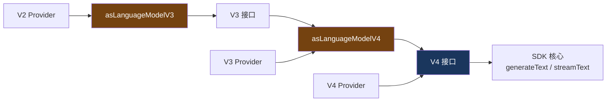

# 8. 版本兼容层

> 源码位置: `packages/ai/src/model/`

## 概述

Vercel AI SDK 的 LanguageModel 接口经历了 V2→V3→V4 的演进。为了让旧版 Provider 继续工作，SDK 提供了 `asLanguageModelV3` 和 `asLanguageModelV4` 适配函数，自动将旧版接口包装为新版。

## 底层原理

### 版本适配链



### asLanguageModelV4：核心适配

```typescript
// as-language-model-v4.ts

function asLanguageModelV4(
  model: LanguageModelV2 | LanguageModelV3 | LanguageModelV4,
): LanguageModelV4 {
  // V4 直接返回
  if (model.specificationVersion === 'v4') {
    return model;
  }

  // V2 先转 V3，再转 V4
  const v3Model = model.specificationVersion === 'v2'
    ? asLanguageModelV3(model)
    : model;

  // 用 Proxy 将 V3 伪装为 V4
  return new Proxy(v3Model, {
    get(target, prop) {
      if (prop === 'specificationVersion') return 'v4';
      return target[prop];
    },
  }) as unknown as LanguageModelV4;
}
```

**关键设计**：使用 `Proxy` 而非创建新对象，保留原始 Provider 的所有方法和属性，只覆盖 `specificationVersion`。

### asLanguageModelV3：V2→V3 转换

```typescript
// as-language-model-v3.ts — 简化版

function asLanguageModelV3(model: LanguageModelV2): LanguageModelV3 {
  return {
    specificationVersion: 'v3',
    provider: model.provider,
    modelId: model.modelId,
    defaultObjectGenerationMode: model.defaultObjectGenerationMode,
    
    async doGenerate(options) {
      const result = await model.doGenerate(options);
      return {
        ...result,
        // V2 → V3 的 usage 格式转换
        usage: convertV2UsageToV3(result.usage),
        // V2 → V3 的 finishReason 转换
        finishReason: convertV2FinishReasonToV3(result.finishReason),
      };
    },
    
    async doStream(options) {
      const result = await model.doStream(options);
      return {
        ...result,
        // 流也需要转换
        stream: convertV2StreamToV3(result.stream),
      };
    },
  };
}

function convertV2UsageToV3(usage: LanguageModelV2Usage): LanguageModelV3Usage {
  return {
    inputTokens: usage.promptTokens,      // 字段重命名
    outputTokens: usage.completionTokens,  // 字段重命名
  };
}
```

### 在 SDK 中的使用位置

```typescript
// wrapLanguageModel 中自动适配
const wrapLanguageModel = ({ model, middleware }) => {
  const v4Model = asLanguageModelV4(model); // 自动升级
  return middlewareChain.reduce((m, mw) => doWrap({ model: m, middleware: mw }), v4Model);
};

// streamText 中自动适配
function streamText({ model, ... }) {
  return new DefaultStreamTextResult({
    model: resolveLanguageModel(model), // 内部调用 asLanguageModelV4
    ...
  });
}
```

### 版本差异对照

| 特性 | V2 | V3 | V4 |
|------|----|----|-----|
| usage 字段 | promptTokens / completionTokens | inputTokens / outputTokens | inputTokens / outputTokens |
| 流 part 类型 | 基础类型 | 结构化（text-start/delta/end） | 同 V3 + 更多类型 |
| supportedUrls | 无 | 无 | 有 |
| providerOptions | 无 | 有 | 有 |
| specificationVersion | 'v2' | 'v3' | 'v4' |

### 与 Claude Code / Codex 的对比

| 维度 | Vercel AI SDK | Claude Code | Codex |
|------|--------------|-------------|-------|
| 版本管理 | 显式版本号 + 适配器 | 无版本概念 | 无版本概念 |
| 向后兼容 | Proxy 自动适配 | 不适用 | 不适用 |
| 升级路径 | V2→V3→V4 渐进 | 直接更新 | 直接更新 |
| Provider 影响 | 旧 Provider 无需修改 | 不适用 | 不适用 |

## 设计原因

- **Proxy 模式**：最小侵入性，不创建新对象，保留原始 Provider 的所有能力
- **链式适配**：V2→V3→V4 分步转换，每步只处理一个版本差异
- **自动适配**：SDK 入口（generateText、wrapLanguageModel）自动调用，Provider 作者无感知
- **向后兼容**：50+ Provider 不需要同时升级，可以按自己的节奏迁移

## 关联知识点

- [LanguageModel 接口](/vercel_ai_docs/provider/language-model-interface) — 各版本的接口定义
- [wrapLanguageModel](/vercel_ai_docs/middleware/wrap-model) — 使用 asLanguageModelV4 的地方
- [OpenAI 适配器](/vercel_ai_docs/provider/openai-adapter) — 具体 Provider 实现
