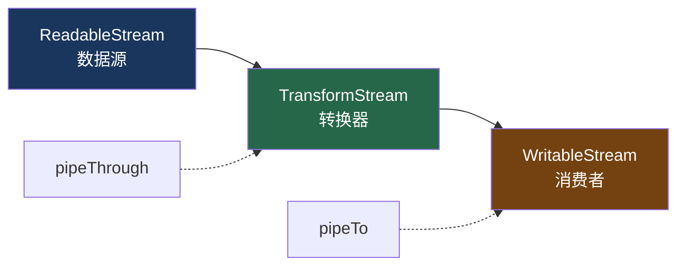

# 9. Web Streams 基础

> 参考: Web Streams API (WHATWG Standard)，在 Vercel AI SDK 中的应用

## 概述

Vercel AI SDK 深度依赖 Web Streams API（`ReadableStream`、`TransformStream`、`WritableStream`）。理解这三个原语是理解 `streamText`、`smoothStream`、SSE 传输等模块的前提。

## 底层原理

### 三大原语



### ReadableStream：数据源

```typescript
// 基本用法
const stream = new ReadableStream({
  start(controller) {
    controller.enqueue('hello');
    controller.enqueue('world');
    controller.close();
  },
});

// SDK 中的典型用法：stitchableStream
const stitchable = createStitchableStream<TextStreamPart>();
// 动态添加子流
stitchable.addStream(step1Stream);
stitchable.addStream(step2Stream);
stitchable.close();
// stitchable.stream 是一个 ReadableStream
```

### TransformStream：转换管道

```typescript
// 基本用法
const uppercase = new TransformStream({
  transform(chunk, controller) {
    controller.enqueue(chunk.toUpperCase());
  },
});

// SDK 中的典型用法：smoothStream
function smoothStream({ delayInMs = 10 }) {
  return () => new TransformStream({
    async transform(chunk, controller) {
      if (chunk.type === 'text-delta') {
        // 缓冲 + 延迟输出
        buffer += chunk.text;
        while ((match = detectChunk(buffer)) != null) {
          controller.enqueue({ type: 'text-delta', text: match });
          buffer = buffer.slice(match.length);
          await delay(delayInMs);
        }
      } else {
        controller.enqueue(chunk); // 非文本直接透传
      }
    },
  });
}
```

### pipeThrough：链式管道

```typescript
// SDK 中的管道链（streamText 内部）
let stream = stitchableStream.stream;

// 1. 停止门控
stream = stream.pipeThrough(new TransformStream({
  transform(chunk, controller) {
    if (isRunning) controller.enqueue(chunk);
  },
}));

// 2. 用户自定义 transform（如 smoothStream）
for (const transform of transforms) {
  stream = stream.pipeThrough(transform({ tools }));
}

// 3. 输出解析
stream = stream.pipeThrough(createOutputTransformStream(output));

// 4. 事件处理（记录步骤、触发回调）
stream = stream.pipeThrough(eventProcessor);
```

### 背压（Backpressure）

```typescript
// Web Streams 的背压是自动的
// 当消费者处理慢时，pull() 不会被调用，生产者自动暂停

const stream = new ReadableStream({
  async pull(controller) {
    // 只有消费者准备好时才会调用
    const data = await fetchNextChunk();
    controller.enqueue(data);
  },
});

// SDK 中的背压场景：
// 1. 客户端网络慢 → SSE 推送自动减速
// 2. smoothStream 的 delay → 上游自动等待
// 3. 工具执行慢 → 模型流暂停
```

### SDK 中的 Stream 使用全景

| 组件 | ReadableStream | TransformStream | 用途 |
|------|---------------|-----------------|------|
| stitchableStream | ✅ 主流 | - | 多步流拼接 |
| smoothStream | - | ✅ | 输出平滑 |
| eventProcessor | - | ✅ | 记录步骤/触发回调 |
| JsonToSseTransformStream | - | ✅ | JSON→SSE 格式 |
| TextEncoderStream | - | ✅ | 字符串→字节 |
| createUIMessageStream | ✅ | - | UI 消息流 |
| textStream getter | - | ✅ | 过滤文本 delta |
| fullStream getter | - | ✅ | 过滤所有 parts |

### tee()：流分叉

```typescript
// DefaultStreamTextResult 中的 tee 用法
class DefaultStreamTextResult {
  private baseStream: ReadableStream;
  
  private teeStream() {
    const [stream1, stream2] = this.baseStream.tee();
    this.baseStream = stream2; // 保留一份继续分叉
    return stream1;            // 返回一份给消费者
  }
  
  get textStream() {
    return this.teeStream().pipeThrough(filterTextDelta());
  }
  
  get fullStream() {
    return this.teeStream().pipeThrough(passThrough());
  }
}
// 注意：tee() 会缓冲数据，适合 LLM 输出（通常不大）
```

### 与 Claude Code / Codex 的对比

| 维度 | Vercel AI SDK | Claude Code | Codex |
|------|--------------|-------------|-------|
| 流 API | Web Streams (标准) | Node.js Streams | Rust tokio streams |
| 管道组合 | pipeThrough 链 | pipe() | 无 |
| 背压 | 原生支持 | 手动管理 | 手动管理 |
| 流分叉 | tee() | 无 | 无 |
| 运行环境 | 浏览器 + Node.js + Edge | Node.js only | 本地 only |

## 设计原因

- **Web 标准**：Web Streams 是 WHATWG 标准，浏览器和 Node.js 都支持
- **Edge 兼容**：Vercel Edge Runtime 原生支持 Web Streams，不支持 Node.js Streams
- **组合性**：pipeThrough 链式调用比回调嵌套更清晰
- **背压免费**：不需要手动管理流量控制

## 关联知识点

- [streamText 流式循环](/vercel_ai_docs/agent/stream-text-loop) — Web Streams 的主要使用者
- [smoothStream](/vercel_ai_docs/streaming/smooth-stream) — TransformStream 实例
- [SSE 传输](/vercel_ai_docs/streaming/sse-transport) — 流到 HTTP 响应的桥接
- [UIMessageStream](/vercel_ai_docs/streaming/ui-message-stream) — 前端消息流
