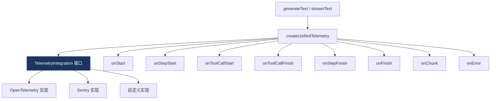
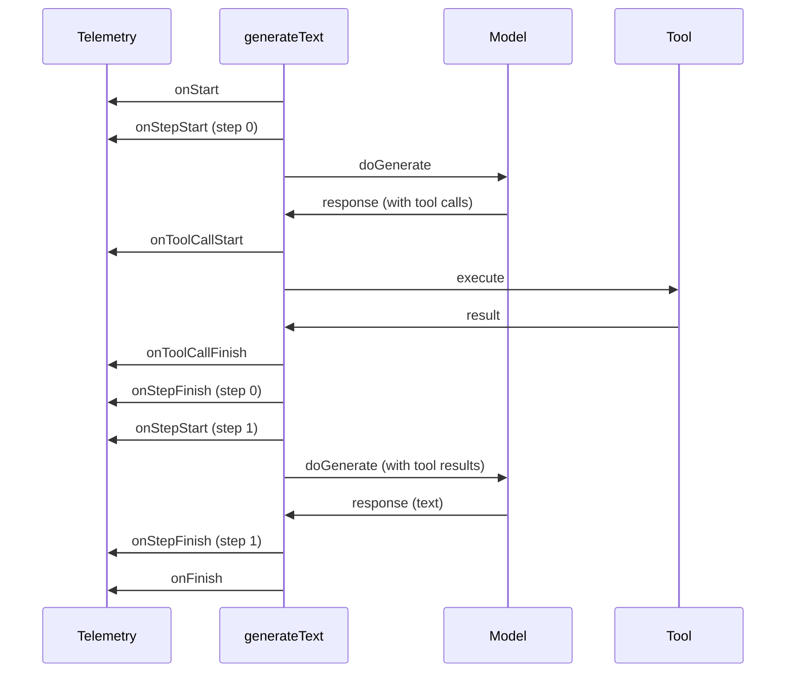

# 21. OpenTelemetry 集成

> 源码位置: `packages/ai/src/telemetry/`

## 概述

Vercel AI SDK 提供了基于 `TelemetryIntegration` 接口的可观测性系统。它不直接依赖 OpenTelemetry SDK，而是定义了一组回调接口，让用户可以接入 OpenTelemetry、Sentry、自定义日志等任何遥测后端。

## 底层原理

### 遥测架构



### TelemetryIntegration 接口

```typescript
// telemetry-integration.ts

interface TelemetryIntegration {
  // 操作开始（generateText/streamText/embed 等）
  onStart?: Callback<OnStartEvent>;
  
  // 步骤开始（单次 LLM 调用）
  onStepStart?: Callback<OnStepStartEvent>;
  
  // 工具执行开始
  onToolCallStart?: Callback<OnToolCallStartEvent>;
  
  // 工具执行完成（成功或失败）
  onToolCallFinish?: Callback<OnToolCallFinishEvent>;
  
  // 流式 chunk（仅 streamText）
  onChunk?: Callback<OnChunkEvent>;
  
  // 步骤完成
  onStepFinish?: Callback<OnStepFinishEvent>;
  
  // 操作完成
  onFinish?: Callback<OnFinishEvent>;
  
  // 错误
  onError?: Callback<unknown>;
  
  // 工具执行上下文（支持嵌套 trace）
  executeTool?: <T>(options: {
    callId: string;
    toolCallId: string;
    execute: () => PromiseLike<T>;
  }) => PromiseLike<T>;
}
```

### 全局注册

```typescript
// telemetry-integration-registry.ts

// 全局注册遥测集成（应用启动时调用一次）
function registerTelemetryIntegration(integration: TelemetryIntegration) {
  globalIntegrations.push(integration);
}

function getGlobalTelemetryIntegrations(): TelemetryIntegration[] {
  return globalIntegrations;
}
```

### createUnifiedTelemetry

```typescript
// create-unified-telemetry.ts — 简化版

function createUnifiedTelemetry({ integrations }) {
  // 合并全局注册的和调用级别的集成
  const allIntegrations = [
    ...getGlobalTelemetryIntegrations(),
    ...(integrations ?? []),
  ];

  return {
    onStart: async (event) => {
      await Promise.allSettled(
        allIntegrations.map(i => i.onStart?.(event))
      );
    },
    onStepStart: async (event) => { /* 同上模式 */ },
    onToolCallStart: async (event) => { /* 同上模式 */ },
    onToolCallFinish: async (event) => { /* 同上模式 */ },
    onChunk: async (event) => { /* 同上模式 */ },
    onStepFinish: async (event) => { /* 同上模式 */ },
    onFinish: async (event) => { /* 同上模式 */ },
    onError: async (event) => { /* 同上模式 */ },
    executeTool: async ({ callId, toolCallId, execute }) => {
      // 链式执行：每个集成包装 execute 函数
      let fn = execute;
      for (const integration of allIntegrations) {
        if (integration.executeTool) {
          const prev = fn;
          fn = () => integration.executeTool!({ callId, toolCallId, execute: prev });
        }
      }
      return fn();
    },
  };
}
```

### 使用示例

```typescript
// 1. 全局注册（应用启动时）
import { registerTelemetryIntegration } from 'ai';

registerTelemetryIntegration({
  onStart: async (event) => {
    console.log(`[${event.operationId}] 开始`, {
      model: event.modelId,
      provider: event.provider,
    });
  },
  onStepFinish: async (event) => {
    console.log(`步骤 ${event.stepNumber} 完成`, {
      finishReason: event.finishReason,
      usage: event.usage,
    });
  },
  onToolCallFinish: async (event) => {
    if (event.success) {
      console.log(`工具 ${event.toolName} 成功`, { durationMs: event.durationMs });
    } else {
      console.error(`工具 ${event.toolName} 失败`, { error: event.error });
    }
  },
  onFinish: async (event) => {
    console.log('完成', { totalUsage: event.totalUsage });
  },
});

// 2. 调用级别集成
const result = await generateText({
  model: openai('gpt-4o'),
  prompt: 'Hello',
  experimental_telemetry: {
    isEnabled: true,
    functionId: 'chat-handler',
    metadata: { userId: '123' },
    integrations: [myCustomIntegration],
  },
});
```

### 遥测事件时序



### 与 Claude Code / Codex 的对比

| 维度 | Vercel AI SDK | Claude Code | Codex |
|------|--------------|-------------|-------|
| 遥测框架 | TelemetryIntegration 接口 | 无内置 | 无内置 |
| 全局注册 | registerTelemetryIntegration | 无 | 无 |
| 事件粒度 | 操作/步骤/工具/chunk | 无 | 无 |
| 嵌套 trace | executeTool 上下文 | 无 | 无 |
| 后端无关 | 接口驱动 | 不适用 | 不适用 |

## 设计原因

- **接口驱动**：不绑定 OpenTelemetry SDK，用户可以接入任何后端
- **全局 + 调用级别**：全局注册用于基础设施，调用级别用于业务特定
- **Promise.allSettled**：一个集成失败不影响其他
- **executeTool 上下文**：支持嵌套 trace（工具内调用 generateText 时 span 正确嵌套）

## 关联知识点

- [generateText 循环](/vercel_ai_docs/agent/generate-text-loop) — 遥测事件的触发点
- [streamText 流式循环](/vercel_ai_docs/agent/stream-text-loop) — onChunk 事件
- [类型安全工具](/vercel_ai_docs/tools/type-safe-tools) — onToolCallStart/Finish
