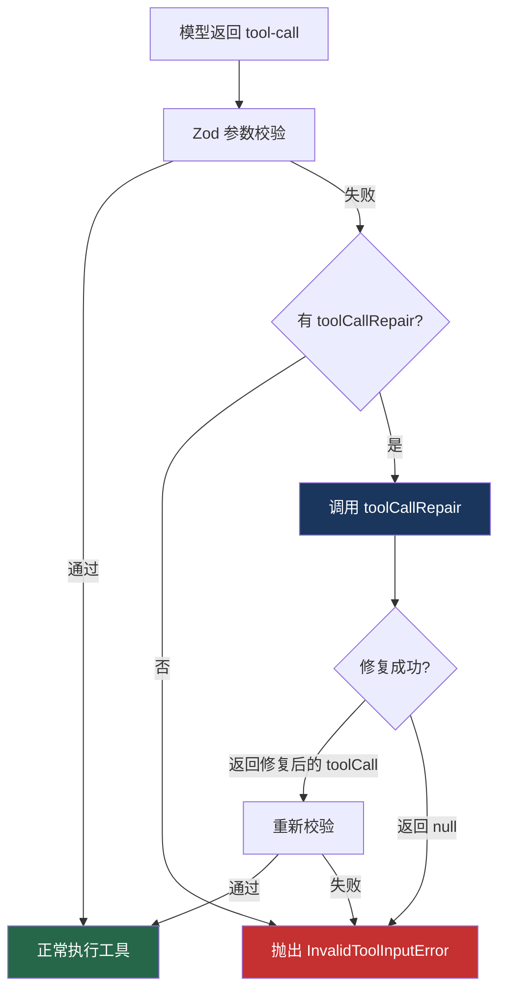

# 17. 工具调用修复

> 源码位置: `packages/ai/src/generate-text/tool-call-repair-function.ts`

## 概述

`toolCallRepair` 是一个可选的修复函数，当模型返回的工具调用参数无法通过 Zod 校验时，SDK 会调用此函数尝试修复。典型场景：模型返回了错误的工具名称或格式不正确的 JSON 参数。

## 底层原理

### 修复流程



### 类型定义

```typescript
// tool-call-repair-function.ts

type ToolCallRepairFunction<TOOLS extends ToolSet> = (options: {
  system: string | SystemModelMessage | Array<SystemModelMessage> | undefined;
  messages: ModelMessage[];           // 当前对话消息
  toolCall: LanguageModelV4ToolCall;  // 失败的工具调用
  tools: TOOLS;                       // 可用工具集
  inputSchema: (options: { toolName: string }) => PromiseLike<JSONSchema7>;  // 获取工具 schema
  error: NoSuchToolError | InvalidToolInputError;  // 错误类型
}) => Promise<LanguageModelV4ToolCall | null>;
```

### 两种错误场景

```typescript
// 场景 1：NoSuchToolError — 工具名称不存在
// 模型返回: { toolName: "get_wether", args: {...} }
// 实际工具: { weather: tool({...}) }
// → 修复函数可以纠正拼写

// 场景 2：InvalidToolInputError — 参数格式错误
// 模型返回: { toolName: "weather", args: { city: 123 } }
// Schema 要求: { city: z.string() }
// → 修复函数可以让模型重新生成参数
```

### 典型修复实现

```typescript
// 使用另一个模型来修复工具调用
const result = await generateText({
  model: openai('gpt-4o'),
  tools,
  prompt: '...',
  experimental_repairToolCall: async ({
    toolCall,
    tools,
    inputSchema,
    error,
  }) => {
    // 策略 1：用模型修复
    const schema = await inputSchema({ toolName: toolCall.toolName });
    
    const repairResult = await generateText({
      model: openai('gpt-4o-mini'), // 用便宜的模型修复
      prompt: `修复以下工具调用：
工具名称: ${toolCall.toolName}
当前参数: ${toolCall.args}
期望 Schema: ${JSON.stringify(schema)}
错误: ${error.message}

请返回修复后的 JSON 参数。`,
    });
    
    try {
      const fixedArgs = JSON.parse(repairResult.text);
      return {
        toolCallType: toolCall.toolCallType,
        toolCallId: toolCall.toolCallId,
        toolName: toolCall.toolName,
        args: JSON.stringify(fixedArgs),
      };
    } catch {
      return null; // 修复失败
    }
  },
});
```

```typescript
// 策略 2：简单的名称纠正
experimental_repairToolCall: async ({ toolCall, tools, error }) => {
  if (error instanceof NoSuchToolError) {
    // 模糊匹配工具名称
    const toolNames = Object.keys(tools);
    const closest = findClosestMatch(toolCall.toolName, toolNames);
    
    if (closest) {
      return { ...toolCall, toolName: closest };
    }
  }
  return null;
},
```

### 在循环中的位置

```typescript
// generate-text.ts / stream-text.ts 中的调用位置

// 解析工具调用时
const toolCalls = response.toolCalls?.map(tc => {
  try {
    return parseToolCall({ tc, tools });
  } catch (error) {
    if (repairToolCall && (error instanceof NoSuchToolError || error instanceof InvalidToolInputError)) {
      // 尝试修复
      const repaired = await repairToolCall({
        system, messages, toolCall: tc, tools, inputSchema, error,
      });
      if (repaired) {
        return parseToolCall({ tc: repaired, tools }); // 重新解析
      }
    }
    throw error;
  }
});
```

### 与 Claude Code / Codex 的对比

| 维度 | Vercel AI SDK | Claude Code | Codex |
|------|--------------|-------------|-------|
| 工具修复 | toolCallRepair 函数 | 无（依赖模型能力） | 无 |
| 修复策略 | 用户自定义 | 不适用 | 不适用 |
| 错误类型 | NoSuchTool / InvalidInput | 不适用 | 不适用 |
| 修复时机 | 解析阶段（执行前） | 不适用 | 不适用 |
| 回退 | 返回 null → 抛出错误 | 不适用 | 不适用 |

## 设计原因

- **可选机制**：不是所有场景都需要修复，作为 experimental 参数提供
- **用户控制**：修复策略由用户定义，SDK 不做假设
- **两次机会**：修复后重新校验，确保修复结果也是合法的
- **错误区分**：NoSuchToolError 和 InvalidToolInputError 需要不同的修复策略

## 关联知识点

- [类型安全工具](/vercel_ai_docs/tools/type-safe-tools) — Zod 校验是修复的触发条件
- [generateText 循环](/vercel_ai_docs/agent/generate-text-loop) — 修复在循环中的位置
- [工具审批](/vercel_ai_docs/tools/tool-approval) — 另一种工具执行控制
