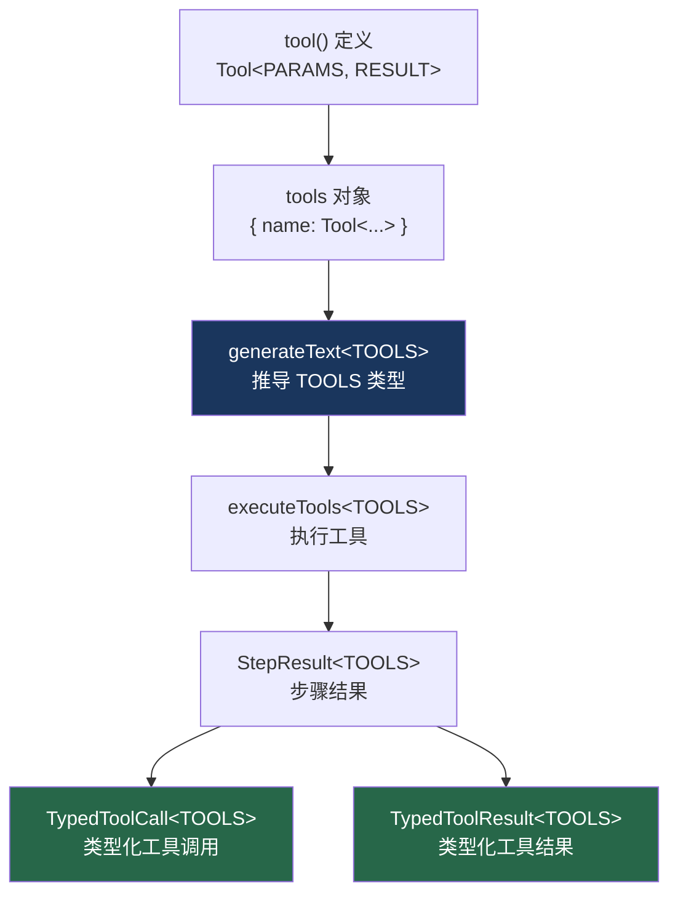

# 20. TypeScript 泛型深度解析

> 参考: `packages/ai/src/generate-text/`, `packages/ai/src/types/`

## 概述

Vercel AI SDK 大量使用 TypeScript 泛型来实现端到端的类型安全。核心泛型参数 `TOOLS` 从 `generateText` 入口一路流转到 `StepResult`，确保工具调用的参数和结果类型在编译时可检查。

## 底层原理

### 泛型流转全景



### TOOLS 泛型的定义

```typescript
// 工具集合类型
type ToolSet = Record<string, Tool>;

// generateText 的泛型签名
async function generateText<
  TOOLS extends ToolSet,           // 工具集合
  USER_CONTEXT extends Context = Context,  // 用户上下文
  OUTPUT extends Output = never,   // 结构化输出
>({ model, tools, ... }): Promise<GenerateTextResult<TOOLS, USER_CONTEXT, OUTPUT>>
```

### 类型推导示例

```typescript
// 定义工具
const tools = {
  weather: tool({
    parameters: z.object({ city: z.string() }),
    execute: async ({ city }) => ({ temp: 20, condition: 'sunny' }),
  }),
  search: tool({
    parameters: z.object({ query: z.string(), limit: z.number().optional() }),
    execute: async ({ query, limit }) => ({ results: ['a', 'b'] }),
  }),
};

// TypeScript 推导出 TOOLS 类型：
// {
//   weather: Tool<{ city: string }, { temp: number; condition: string }>;
//   search: Tool<{ query: string; limit?: number }, { results: string[] }>;
// }

const result = await generateText({ model, tools, prompt: '...' });

// result.toolCalls 的类型（联合类型）：
type ToolCalls = Array<
  | { toolName: 'weather'; args: { city: string } }
  | { toolName: 'search'; args: { query: string; limit?: number } }
>;

// result.toolResults 的类型：
type ToolResults = Array<
  | { toolName: 'weather'; result: { temp: number; condition: string } }
  | { toolName: 'search'; result: { results: string[] } }
>;
```

### TypedToolCall 条件类型

```typescript
// 将 TOOLS 映射为工具调用的联合类型
type TypedToolCall<TOOLS extends ToolSet> = {
  [K in keyof TOOLS]: {
    toolCallId: string;
    toolName: K & string;
    args: TOOLS[K] extends Tool<infer PARAMS, any>
      ? z.infer<PARAMS>  // 从 Zod schema 推导参数类型
      : never;
  };
}[keyof TOOLS];

// 展开后（以上面的 tools 为例）：
// | { toolCallId: string; toolName: 'weather'; args: { city: string } }
// | { toolCallId: string; toolName: 'search'; args: { query: string; limit?: number } }
```

### TypedToolResult 条件类型

```typescript
// 将 TOOLS 映射为工具结果的联合类型
type TypedToolResult<TOOLS extends ToolSet> = {
  [K in keyof TOOLS]: {
    toolCallId: string;
    toolName: K & string;
    args: z.infer<TOOLS[K]['parameters']>;
    result: TOOLS[K] extends Tool<any, infer RESULT>
      ? RESULT  // 从 execute 返回类型推导
      : never;
  };
}[keyof TOOLS];
```

### NoInfer 的使用

```typescript
// generateText 签名中的 NoInfer
function generateText<TOOLS extends ToolSet>({
  tools,
  stopWhen,
  activeTools,
}: {
  tools?: TOOLS;
  // NoInfer 防止 stopWhen 的参数影响 TOOLS 的推导
  stopWhen?: StopCondition<NoInfer<TOOLS>>;
  // NoInfer 防止 activeTools 影响 TOOLS 的推导
  activeTools?: Array<keyof NoInfer<TOOLS>>;
})

// 没有 NoInfer 的问题：
// TypeScript 可能从 stopWhen 或 activeTools 反向推导 TOOLS，
// 导致类型变宽或推导失败
```

### Context 泛型

```typescript
// USER_CONTEXT 允许工具访问自定义上下文
const result = await generateText({
  model,
  context: { db: database, user: currentUser },
  tools: {
    query: tool({
      parameters: z.object({ sql: z.string() }),
      execute: async ({ sql }, { context }) => {
        // context 类型自动推导为 { db: Database; user: User }
        return context.db.query(sql);
      },
    }),
  },
});
```

### OUTPUT 泛型

```typescript
// 结构化输出的类型推导
import { Output } from 'ai';

const result = await generateText({
  model,
  output: Output.object({
    schema: z.object({
      name: z.string(),
      age: z.number(),
    }),
  }),
  prompt: '...',
});

// result.output 的类型：{ name: string; age: number }
// 由 OUTPUT 泛型推导
```

### 与 Claude Code / Codex 的对比

| 维度 | Vercel AI SDK | Claude Code | Codex |
|------|--------------|-------------|-------|
| 类型安全 | 端到端泛型推导 | 无（JavaScript 风格） | 部分（TypeScript） |
| 工具类型 | Zod → TypeScript 自动推导 | JSON Schema（无类型推导） | JSON Schema |
| 条件类型 | TypedToolCall / TypedToolResult | 无 | 无 |
| NoInfer | 防止反向推导 | 不适用 | 不适用 |
| Context 类型 | 泛型参数 | 无类型 | 无类型 |

## 设计原因

- **Zod 驱动**：Zod 的 `z.infer` 是类型推导的基础
- **联合类型**：工具调用/结果是联合类型，TypeScript 可以通过 `toolName` 缩窄
- **NoInfer**：防止辅助参数污染主要泛型的推导
- **端到端**：从工具定义到结果消费，类型信息不丢失

## 关联知识点

- [类型安全工具](/vercel_ai_docs/tools/type-safe-tools) — 泛型的实际应用
- [generateText 循环](/vercel_ai_docs/agent/generate-text-loop) — 泛型的入口
- [停止条件](/vercel_ai_docs/agent/stop-condition) — NoInfer 的使用场景
