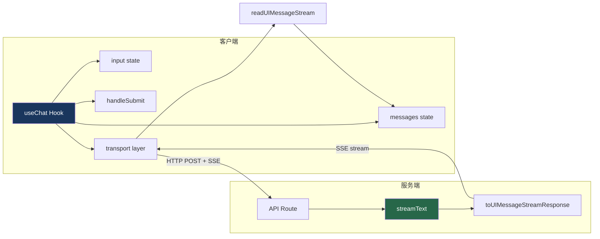

# 18. useChat Hook

> 源码位置: `packages/ai/src/ui/chat.ts`, `packages/react/src/use-chat.ts`

## 概述

`useChat` 是 Vercel AI SDK 的核心前端 Hook，管理聊天状态、消息发送、流式接收。它连接客户端 UI 和服务端的 `streamText`，通过 SSE 传输 UIMessageStream 协议的数据。

## 底层原理

### 架构关系



### 核心 API

```typescript
// React 用法
import { useChat } from '@ai-sdk/react';

function ChatComponent() {
  const {
    messages,        // UIMessage[] — 消息列表
    input,           // string — 输入框内容
    setInput,        // 设置输入
    handleInputChange, // 输入框 onChange 处理
    handleSubmit,    // 表单 onSubmit 处理
    isLoading,       // 是否正在生成
    error,           // 错误信息
    reload,          // 重新生成最后一条
    stop,            // 停止生成
    append,          // 追加消息
    setMessages,     // 直接设置消息列表
    addToolResult,   // 添加工具结果（用于客户端工具执行）
  } = useChat({
    api: '/api/chat',           // API 端点
    initialMessages: [],         // 初始消息
    onFinish: (message) => {},   // 完成回调
    onError: (error) => {},      // 错误回调
    maxSteps: 5,                 // 客户端最大步数
  });

  return (
    <form onSubmit={handleSubmit}>
      {messages.map(m => (
        <div key={m.id}>
          {m.role}: {m.parts.map(renderPart)}
        </div>
      ))}
      <input value={input} onChange={handleInputChange} />
    </form>
  );
}
```

### 消息结构

```typescript
// UIMessage 类型
interface UIMessage {
  id: string;
  role: 'user' | 'assistant' | 'system';
  parts: UIMessagePart[];  // 结构化内容
  createdAt?: Date;
  metadata?: unknown;
}

// UIMessagePart 类型
type UIMessagePart =
  | { type: 'text'; text: string }
  | { type: 'reasoning'; text: string }
  | { type: 'tool-invocation'; toolInvocation: ToolInvocation }
  | { type: 'source-url'; sourceId: string; url: string }
  | { type: 'file'; mediaType: string; url: string }
  | { type: 'step-start' }
  | { type: 'step-finish' };
```

### Transport 层

```typescript
// 默认 HTTP transport
// useChat 内部通过 fetch 发送 POST 请求，接收 SSE 响应

async function callChatApi({
  api,
  messages,
  body,
  headers,
  abortController,
  onUpdate,
  onFinish,
}) {
  const response = await fetch(api, {
    method: 'POST',
    headers: { 'Content-Type': 'application/json', ...headers },
    body: JSON.stringify({ messages, ...body }),
    signal: abortController.signal,
  });

  // 解析 SSE 流
  await readUIMessageStream({
    reader: response.body.getReader(),
    onChunk: (chunk) => {
      // 根据 chunk 类型更新 messages state
      switch (chunk.type) {
        case 'text-delta':
          updateLastMessage(msg => appendText(msg, chunk.delta));
          break;
        case 'tool-call-start':
          updateLastMessage(msg => addToolCall(msg, chunk));
          break;
        case 'tool-result':
          updateLastMessage(msg => setToolResult(msg, chunk));
          break;
        // ...
      }
      onUpdate(messages);
    },
  });
  
  onFinish(lastMessage);
}
```

### 服务端配合

```typescript
// Next.js App Router
// app/api/chat/route.ts

import { streamText } from 'ai';
import { openai } from '@ai-sdk/openai';

export async function POST(req: Request) {
  const { messages } = await req.json();
  
  const result = streamText({
    model: openai('gpt-4o'),
    system: '你是一个有帮助的助手',
    messages,
    tools: {
      weather: tool({
        parameters: z.object({ city: z.string() }),
        execute: async ({ city }) => getWeather(city),
      }),
    },
  });
  
  return result.toUIMessageStreamResponse();
}
```

### 客户端工具执行

```typescript
// 某些工具需要在客户端执行（如访问浏览器 API）
const { messages, addToolResult } = useChat({
  maxSteps: 5,
  async onToolCall({ toolCall }) {
    if (toolCall.toolName === 'getLocation') {
      const position = await navigator.geolocation.getCurrentPosition();
      return { lat: position.coords.latitude, lng: position.coords.longitude };
    }
  },
});
```

### 与 Claude Code / Codex 的对比

| 维度 | useChat | Claude Code | Codex |
|------|--------|-------------|-------|
| 运行环境 | 浏览器 | 终端 (Node.js) | 终端 (Rust) |
| UI 框架 | React/Vue/Svelte/Angular | Ink (React) | Ratatui |
| 传输协议 | SSE over HTTP | 进程内 | 进程内 |
| 状态管理 | React state | Ink state | Rust state |
| 工具执行 | 客户端 + 服务端 | 服务端 | 服务端 |
| 流式更新 | UIMessageStream chunks | 直接渲染 | 直接渲染 |

## 设计原因

- **声明式**：useChat 管理所有状态，组件只需渲染
- **Transport 抽象**：默认 HTTP，可替换为 WebSocket 或直接调用
- **消息驱动**：所有交互通过消息传递，与服务端 streamText 对齐
- **多框架**：核心逻辑在 `packages/ai/src/ui/chat.ts`，各框架只是薄封装

## 关联知识点

- [UIMessageStream](/vercel_ai_docs/streaming/ui-message-stream) — 传输协议
- [SSE 传输](/vercel_ai_docs/streaming/sse-transport) — 底层传输
- [多框架支持](/vercel_ai_docs/ui/multi-framework) — React/Vue/Svelte/Angular
- [streamText 流式循环](/vercel_ai_docs/agent/stream-text-loop) — 服务端数据源
