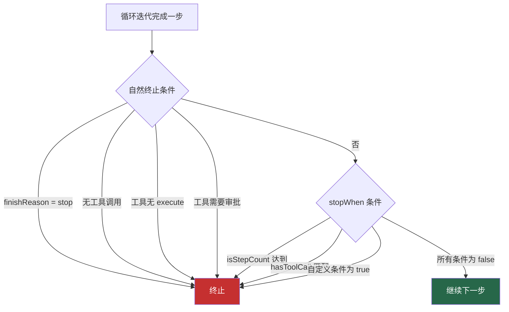

# 4. 停止条件（Stop Conditions）

> 源码位置: `packages/ai/src/generate-text/stop-condition.ts`

## 概述

停止条件决定 Agent Loop 何时终止。Vercel AI SDK 提供了声明式的 `StopCondition` 类型和几个内置实现，同时支持自定义停止逻辑。停止条件与循环的自然终止条件（finishReason、无 execute 函数、需要审批）共同作用。

## 底层原理

### 终止条件全景



### 类型定义

```typescript
// stop-condition.ts

// 停止条件是一个谓词函数
type StopCondition<TOOLS extends ToolSet, USER_CONTEXT extends Context = Context> = 
  (options: {
    steps: Array<StepResult<TOOLS, USER_CONTEXT>>;
  }) => PromiseLike<boolean> | boolean;  // 支持同步和异步
```

### 内置停止条件

```typescript
// 1. isStepCount — 步数限制
function isStepCount(stepCount: number): StopCondition<any, any> {
  return ({ steps }) => steps.length === stepCount;
}

// 2. isLoopFinished — 永不停止（依赖自然终止）
function isLoopFinished(): StopCondition<any, any> {
  return () => false;
}

// 3. hasToolCall — 特定工具被调用时停止
function hasToolCall<TOOLS extends ToolSet>(
  ...toolName: Array<keyof TOOLS | (string & {})>
): StopCondition<TOOLS, any> {
  return ({ steps }) =>
    steps[steps.length - 1]?.toolCalls?.some(
      toolCall => toolName.includes(toolCall.toolName)
    ) ?? false;
}
```

### 停止条件评估

```typescript
// 多个停止条件的评估（OR 逻辑）
async function isStopConditionMet({ stopConditions, steps }) {
  return (
    await Promise.all(stopConditions.map(condition => condition({ steps })))
  ).some(result => result);  // 任一条件为 true 即停止
}
```

**关键设计**：`stopWhen` 参数支持单个条件或数组，数组中的条件是 OR 关系。

### 在循环中的集成

```typescript
// generateText 中的使用
for (let stepCount = 0; stepCount < maxSteps; stepCount++) {
  // ... 执行模型调用和工具 ...
  
  // 检查停止条件（在 onStepFinish 之后）
  if (stopWhen && await isStopConditionMet({ stopConditions: asArray(stopWhen), steps })) {
    break;
  }
  if (response.finishReason === 'stop') break;
  if (!toolCalls?.length) break;
}

// streamText 中的使用（在 flush 回调中）
async flush(controller) {
  await stepFinish.promise; // 等待步骤处理完成
  
  if (hasToolCalls && !(await isStopConditionMet({ stopConditions, steps: recordedSteps }))) {
    await streamStep({ currentStep: currentStep + 1, ... }); // 继续
  } else {
    self.closeStream(); // 终止
  }
}
```

### 自定义停止条件示例

```typescript
// 示例 1：当找到答案时停止
const stopWhenAnswerFound: StopCondition<typeof tools> = ({ steps }) => {
  const lastStep = steps[steps.length - 1];
  return lastStep?.text?.includes('FINAL ANSWER:') ?? false;
};

// 示例 2：当 token 消耗超过阈值时停止
const stopWhenExpensive: StopCondition<typeof tools> = ({ steps }) => {
  const totalTokens = steps.reduce(
    (sum, step) => sum + (step.usage?.totalTokens ?? 0), 0
  );
  return totalTokens > 10000;
};

// 示例 3：异步停止条件（检查外部状态）
const stopWhenCancelled: StopCondition<typeof tools> = async ({ steps }) => {
  const status = await db.getTaskStatus(taskId);
  return status === 'cancelled';
};

// 组合使用
const result = await generateText({
  model: openai('gpt-4o'),
  tools,
  maxSteps: 50,
  stopWhen: [stopWhenAnswerFound, stopWhenExpensive, isStepCount(30)],
});
```

### 默认值差异

| 上下文 | 默认 stopWhen | 默认 maxSteps |
|--------|-------------|--------------|
| generateText | isStepCount(1) | 1 |
| streamText | isStepCount(1) | 无 |
| ToolLoopAgent | isStepCount(20) | 无 |

### 与 Claude Code / Codex 的对比

| 维度 | Vercel AI SDK | Claude Code | Codex |
|------|--------------|-------------|-------|
| 停止机制 | StopCondition 谓词 | 多种终止条件硬编码 | 事件驱动终止 |
| 可扩展性 | 完全自定义 | 不可扩展 | 不可扩展 |
| 异步支持 | PromiseLike | 同步 | 同步 |
| 组合方式 | 数组（OR 逻辑） | 固定优先级 | 固定优先级 |
| 步数限制 | isStepCount | maxTurns | 内部限制 |
| 工具触发停止 | hasToolCall | 无 | 无 |

## 设计原因

- **声明式**：停止条件是纯函数，易于测试和组合
- **OR 语义**：多个条件任一满足即停止，符合"安全阀"直觉
- **异步支持**：允许检查外部状态（数据库、API）
- **与自然终止分离**：stopWhen 是额外的停止逻辑，不替代 finishReason 等自然终止

## 关联知识点

- [generateText 循环](/agent/generate-text-loop) — 停止条件的使用场景
- [ToolLoopAgent](/agent/tool-loop-agent) — 默认 isStepCount(20)
- [工具审批](/tools/tool-approval) — 另一种终止触发
