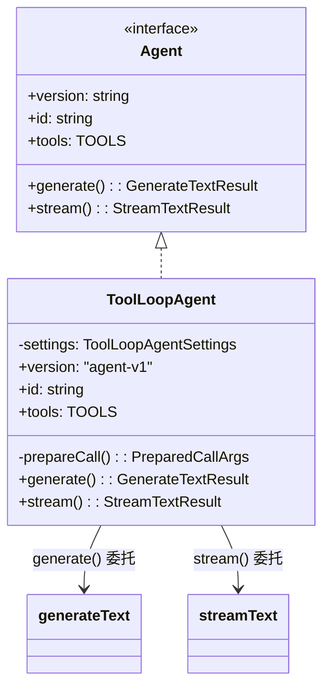

# 3. ToolLoopAgent

> 源码位置: `packages/ai/src/agent/tool-loop-agent.ts`

## 概述

`ToolLoopAgent` 是 Vercel AI SDK 的 Agent 抽象层。它封装了 `generateText` / `streamText`，提供 `prepareCall` 钩子、回调合并、默认停止条件（`isStepCount(20)`）等功能。本质上是一个配置容器，不引入新的循环逻辑。

## 底层原理

### 类结构



### 核心源码

```typescript
// tool-loop-agent.ts — 简化版

class ToolLoopAgent<CALL_OPTIONS, TOOLS, USER_CONTEXT, OUTPUT>
  implements Agent<CALL_OPTIONS, TOOLS, USER_CONTEXT, OUTPUT> {
  
  readonly version = 'agent-v1';
  private readonly settings: ToolLoopAgentSettings;

  // 1. prepareCall：合并设置和运行时参数
  private async prepareCall(options) {
    const { experimental_onStart, onStepFinish, onFinish, ...settingsWithoutCallbacks } = this.settings;
    
    const baseCallArgs = {
      ...settingsWithoutCallbacks,
      stopWhen: this.settings.stopWhen ?? isStepCount(20), // 默认 20 步
      ...options,
    };

    // 允许用户通过 prepareCall 钩子动态修改参数
    const preparedCallArgs = await this.settings.prepareCall?.(baseCallArgs) ?? baseCallArgs;
    
    const { instructions, messages, prompt, context, ...callArgs } = preparedCallArgs;
    return { ...callArgs, system: instructions, messages, prompt };
  }

  // 2. generate：非流式调用
  async generate({ onStepFinish, onFinish, ...options }) {
    const preparedCall = await this.prepareCall(options);
    return generateText({
      ...preparedCall,
      // 回调合并：settings 级别 + 调用级别
      onStepFinish: mergeCallbacks(this.settings.onStepFinish, onStepFinish),
      onFinish: mergeCallbacks(this.settings.onFinish, onFinish),
    });
  }

  // 3. stream：流式调用
  async stream({ experimental_transform, onStepFinish, onFinish, ...options }) {
    const preparedCall = await this.prepareCall(options);
    return streamText({
      ...preparedCall,
      experimental_transform,
      onStepFinish: mergeCallbacks(this.settings.onStepFinish, onStepFinish),
      onFinish: mergeCallbacks(this.settings.onFinish, onFinish),
    });
  }
}
```

### 回调合并机制

```typescript
// merge-callbacks.ts

function mergeCallbacks<EVENT>(...callbacks: Array<Callback<EVENT> | undefined>): Callback<EVENT> {
  return async (event: EVENT) => {
    // 并行执行所有回调，忽略错误
    await Promise.allSettled(
      callbacks.map(async callback => await callback?.(event))
    );
  };
}
```

**设计要点**：
- `Promise.allSettled` 而非 `Promise.all`——一个回调失败不影响其他
- settings 级别的回调（构造时）和调用级别的回调（运行时）合并执行
- 支持 6 种回调：`onStart`、`onStepStart`、`onToolCallStart`、`onToolCallFinish`、`onStepFinish`、`onFinish`

### prepareCall 钩子

```typescript
// 使用示例：动态调整模型和工具
const agent = new ToolLoopAgent({
  model: openai('gpt-4o'),
  tools: { search, write, execute },
  prepareCall: async (args) => {
    // 根据上下文动态切换模型
    if (args.prompt?.includes('简单问题')) {
      return { ...args, model: openai('gpt-4o-mini') };
    }
    // 根据步骤数限制工具
    return args;
  },
});
```

### 与 Claude Code / Codex Agent 的对比

| 维度 | ToolLoopAgent | Claude Code Agent | Codex Agent |
|------|--------------|-------------------|-------------|
| 抽象层级 | 配置容器 | 完整 Agent 运行时 | 完整 Agent 运行时 |
| 循环实现 | 委托给 generateText/streamText | 自己的 while(true) | 自己的事件循环 |
| 默认步数 | 20 | 无固定上限 | 无固定上限 |
| 动态配置 | prepareCall 钩子 | 无 | 无 |
| 回调系统 | mergeCallbacks（并行） | Hooks 系统 | 事件驱动 |
| 上下文管理 | context 泛型参数 | State 对象 | 内部状态 |
| 记忆/压缩 | 不提供 | 7 层防御 | 自动压缩 |

## 设计原因

- **薄封装**：ToolLoopAgent 不引入新逻辑，只是 generateText/streamText 的配置层
- **默认 20 步**：比 generateText 的默认 1 步更适合 Agent 场景，但仍有上限
- **回调合并**：允许在构造时和调用时分别注册回调，灵活性高
- **prepareCall**：动态配置的唯一入口，保持 API 简洁

## 关联知识点

- [generateText 循环](/agent/generate-text-loop) — 底层循环实现
- [streamText 流式循环](/agent/stream-text-loop) — 流式版本
- [停止条件](/agent/stop-condition) — isStepCount 等停止逻辑
- [类型安全工具](/tools/type-safe-tools) — 工具定义
