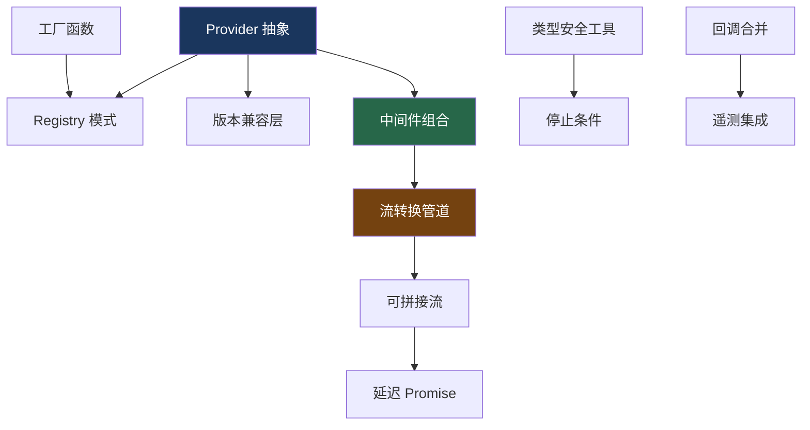

# 23. 设计模式速查表

> 从 Vercel AI SDK 源码中提取的 12+ 种可复用设计模式

## 模式一览

| # | 模式 | 源码位置 | 核心思想 |
|---|------|---------|---------|
| 1 | Provider 抽象 | `provider/` | 统一接口，多实现 |
| 2 | 中间件组合 | `middleware/` | 装饰器链，洋葱模型 |
| 3 | 类型安全工具 | `generate-text/` | Zod → TypeScript 推导 |
| 4 | 版本兼容层 | `model/` | Proxy 适配旧版接口 |
| 5 | 流转换管道 | `generate-text/stream-text.ts` | TransformStream 链 |
| 6 | Registry 模式 | `registry/` | 字符串 ID 查找 |
| 7 | 回调合并 | `util/merge-callbacks.ts` | Promise.allSettled 并行 |
| 8 | 停止条件 | `generate-text/stop-condition.ts` | 声明式谓词 |
| 9 | 可拼接流 | `util/create-stitchable-stream.ts` | 动态流拼接 |
| 10 | 延迟 Promise | `util/delayed-promise.ts` | 流式结果的 Promise 化 |
| 11 | 工厂函数 | `openai/` 等 | 可调用对象 |
| 12 | 遥测集成 | `telemetry/` | 接口驱动，全局注册 |

## 详细解析

### 1. Provider 抽象（Strategy Pattern）

```typescript
// 统一接口
type LanguageModelV4 = {
  doGenerate(options): Promise<GenerateResult>;
  doStream(options): Promise<StreamResult>;
};

// 多实现
class OpenAIChatModel implements LanguageModelV4 { ... }
class AnthropicModel implements LanguageModelV4 { ... }
class GoogleModel implements LanguageModelV4 { ... }

// 使用者不关心具体实现
const result = await generateText({ model: anyProvider('any-model') });
```

**适用场景**：需要支持多个后端/服务/数据源的系统。

### 2. 中间件组合（Decorator + Chain of Responsibility）

```typescript
// 中间件是装饰器，返回相同接口
const wrapped = wrapLanguageModel({
  model,
  middleware: [a, b, c], // reverse 后：c 最内层，a 最外层
});

// 洋葱模型：a(b(c(model)))
// transformParams: a → b → c
// wrapGenerate: a → b → c → model → c → b → a
```

**适用场景**：需要在核心逻辑前后插入横切关注点（日志、缓存、限流）。

### 3. 类型安全工具（Generic Inference）

```typescript
// Zod schema → TypeScript 类型自动推导
const t = tool({
  parameters: z.object({ city: z.string() }),
  execute: async ({ city }) => ({ temp: 20 }),
  //                  ^ 自动推导为 string
});

// TOOLS 泛型贯穿整个调用链
generateText<TOOLS> → executeTools<TOOLS> → StepResult<TOOLS>
```

**适用场景**：需要端到端类型安全的插件/扩展系统。

### 4. 版本兼容层（Proxy Adapter）

```typescript
// 用 Proxy 将旧版接口伪装为新版
function asLanguageModelV4(model: V2 | V3 | V4): V4 {
  if (model.specificationVersion === 'v4') return model;
  const v3 = model.specificationVersion === 'v2' ? asV3(model) : model;
  return new Proxy(v3, {
    get(target, prop) {
      if (prop === 'specificationVersion') return 'v4';
      return target[prop];
    },
  });
}
```

**适用场景**：接口演进时需要向后兼容。

### 5. 流转换管道（Pipeline Pattern）

```typescript
// TransformStream 链式组合
let stream = source;
stream = stream.pipeThrough(gateTransform);      // 门控
stream = stream.pipeThrough(smoothStream());      // 平滑
stream = stream.pipeThrough(outputTransform);     // 输出解析
stream = stream.pipeThrough(eventProcessor);      // 事件处理
```

**适用场景**：数据需要经过多步转换的流式处理。

### 6. Registry 模式（Service Locator）

```typescript
// 字符串 ID → 实例查找
const registry = createProviderRegistry({ openai, anthropic });
const model = registry.languageModel('openai:gpt-4o');
// splitId: "openai:gpt-4o" → ["openai", "gpt-4o"]
```

**适用场景**：需要通过配置（字符串）动态选择实现。

### 7. 回调合并（Observer Merge）

```typescript
// 多个回调并行执行，互不影响
function mergeCallbacks(...callbacks) {
  return async (event) => {
    await Promise.allSettled(callbacks.map(cb => cb?.(event)));
  };
}
// 用于：settings 级别 + 调用级别的回调合并
```

**适用场景**：多个观察者需要响应同一事件。

### 8. 停止条件（Predicate Pattern）

```typescript
// 声明式谓词，可组合
type StopCondition = (options: { steps }) => boolean | PromiseLike<boolean>;

const conditions = [isStepCount(20), hasToolCall('finish')];
const shouldStop = (await Promise.all(conditions.map(c => c({ steps })))).some(Boolean);
```

**适用场景**：需要灵活的终止/过滤条件。

### 9. 可拼接流（Stitchable Stream）

```typescript
// 动态拼接多个 ReadableStream
const { stream, addStream, close } = createStitchableStream();
addStream(step1Stream); // 第一步的流
addStream(step2Stream); // 第二步的流（第一步结束后）
close();
// stream 对消费者是一个连续的流
```

**适用场景**：多阶段流式处理，每阶段的流在运行时才知道。

### 10. 延迟 Promise（Deferred Promise）

```typescript
// 流式结果的 Promise 化
class DefaultStreamTextResult {
  private _totalUsage = new DelayedPromise<Usage>();
  
  get totalUsage() {
    this.consumeStream(); // 确保流被消费
    return this._totalUsage.promise;
  }
  // 流结束时：this._totalUsage.resolve(usage);
}
```

**适用场景**：结果在异步过程中才确定，但需要提供 Promise API。

### 11. 工厂函数（Factory + Callable Object）

```typescript
// Provider 工厂返回可调用对象
const openai = createOpenAI({ apiKey: '...' });
openai('gpt-4o');                    // 简写
openai.languageModel('gpt-4o');      // 完整写法
openai.embedding('text-embedding-3'); // 其他模型类型
```

**适用场景**：需要简洁 API 同时支持多种创建方式。

### 12. 遥测集成（Integration Registry）

```typescript
// 全局注册 + 调用级别注册
registerTelemetryIntegration(globalIntegration);

generateText({
  experimental_telemetry: {
    integrations: [callLevelIntegration],
  },
});
// 两者合并执行
```

**适用场景**：横切关注点需要全局和局部两种注册方式。

## 模式组合



## 关联知识点

- [学习路线](/appendix/roadmap) — 按模式分组的学习建议
- [generateText 循环](/agent/generate-text-loop) — 多个模式的综合应用
