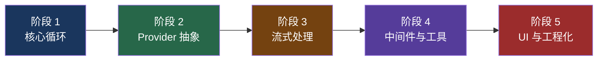

# 24. 学习路线图

## 五阶段学习路径



## 阶段 1：核心循环（2-3 天）

**目标**：理解 Agent Loop 的本质

| 顺序 | 文档 | 重点 |
|------|------|------|
| 1 | [快速开始](/guide/getting-started) | 项目全貌、术语速查 |
| 2 | [generateText 循环](/agent/generate-text-loop) | for 循环、maxSteps、工具执行 |
| 3 | [停止条件](/agent/stop-condition) | isStepCount、hasToolCall、自定义 |
| 4 | [ToolLoopAgent](/agent/tool-loop-agent) | Agent 抽象、prepareCall、回调合并 |

**练习**：用 generateText 实现一个简单的多步工具调用 Agent。

## 阶段 2：Provider 抽象（2-3 天）

**目标**：理解如何支持 50+ 模型提供商

| 顺序 | 文档 | 重点 |
|------|------|------|
| 5 | [LanguageModel 接口](/provider/language-model-interface) | V4 接口、doGenerate/doStream |
| 6 | [Provider Registry](/provider/registry) | splitId、类型安全查找 |
| 7 | [OpenAI 适配器](/provider/openai-adapter) | 消息转换、工具格式映射 |
| 8 | [版本兼容](/provider/version-compat) | asLanguageModelV4、Proxy 适配 |

**练习**：阅读一个 Provider 的完整源码（推荐 OpenAI 或 Anthropic）。

## 阶段 3：流式处理（2-3 天）

**目标**：理解 Web Streams 在 AI 应用中的应用

| 顺序 | 文档 | 重点 |
|------|------|------|
| 9 | [Web Streams 基础](/streaming/web-streams) | ReadableStream、TransformStream、背压 |
| 10 | [streamText 流式循环](/agent/stream-text-loop) | stitchableStream、递归 streamStep |
| 11 | [smoothStream](/streaming/smooth-stream) | 分块策略、延迟控制 |
| 12 | [SSE 传输](/streaming/sse-transport) | JsonToSseTransformStream |
| 13 | [UIMessageStream](/streaming/ui-message-stream) | 前端协议、writer.merge() |

**练习**：实现一个自定义 TransformStream（如过滤敏感词）。

## 阶段 4：中间件与工具（2-3 天）

**目标**：理解扩展机制

| 顺序 | 文档 | 重点 |
|------|------|------|
| 14 | [wrapLanguageModel](/middleware/wrap-model) | 装饰器模式、reverse 顺序 |
| 15 | [内置中间件](/middleware/builtin) | 5 个内置中间件的实现 |
| 16 | [类型安全工具](/tools/type-safe-tools) | Zod schema、泛型推导 |
| 17 | [工具审批](/tools/tool-approval) | 人工确认流程 |
| 18 | [工具修复](/tools/tool-repair) | 参数修复机制 |

**练习**：实现一个自定义中间件（如缓存中间件）。

## 阶段 5：UI 与工程化（2-3 天）

**目标**：理解全栈集成和工程实践

| 顺序 | 文档 | 重点 |
|------|------|------|
| 19 | [useChat](/ui/use-chat) | 前端状态管理、transport 层 |
| 20 | [多框架支持](/ui/multi-framework) | 共享核心、薄适配层 |
| 21 | [TypeScript 泛型](/types/generics) | TOOLS 泛型流转、NoInfer |
| 22 | [OpenTelemetry](/telemetry/otel) | 遥测集成、全局注册 |
| 23 | [Monorepo 架构](/build/monorepo) | pnpm + Turborepo + tsup |
| 24 | [设计模式](/appendix/patterns) | 12+ 种模式速查 |

**练习**：搭建一个完整的 Next.js + useChat 应用。

## 与 Claude Code / Codex 学习路径的对比

| 阶段 | Vercel AI SDK | Claude Code | Codex |
|------|--------------|-------------|-------|
| 入门 | generateText 循环 | queryLoop 循环 | 事件循环 |
| 核心抽象 | LanguageModel 接口 | 无（单一 Provider） | 无（少数 Provider） |
| 流式 | Web Streams + SSE | Ink 渲染 | Ratatui 渲染 |
| 扩展 | 中间件 + 工具 | Hooks + 权限 | 沙箱 + 权限 |
| 工程化 | Monorepo (50+ 包) | 单包 | Cargo workspace |

### 学习重点差异

```
Vercel AI SDK 重点：
  → Provider 抽象（如何支持 50+ 模型）
  → 流式处理（Web Streams 管道）
  → 类型系统（泛型推导）
  → 中间件（装饰器模式）

Claude Code 重点：
  → 上下文管理（7 层压缩防御）
  → 权限系统（Seatbelt/Bubblewrap）
  → 错误恢复（PTL/max-tokens/fallback）
  → 记忆系统（CLAUDE.md + Dream Mode）

Codex 重点：
  → 沙箱安全（Landlock/Seatbelt）
  → Rust 性能（tokio 异步运行时）
  → 事件驱动架构
  → 多模型支持
```

## 面试重点区域

### 高频考点

| 主题 | 关键知识点 | 对应文档 |
|------|----------|---------|
| Agent Loop | for 循环 vs while(true)、maxSteps、停止条件 | 阶段 1 |
| Provider 抽象 | 接口设计、版本兼容、Registry | 阶段 2 |
| 流式处理 | Web Streams、背压、SSE | 阶段 3 |
| 中间件 | 装饰器模式、组合顺序 | 阶段 4 |
| 类型系统 | 泛型推导、Zod、条件类型 | 阶段 5 |

### 对比题准备

面试中常见的对比问题：

1. **generateText vs streamText**：阻塞 vs 流式、for 循环 vs 递归
2. **Vercel AI SDK vs Claude Code**：框架 vs 产品、Provider 抽象 vs 单一 Provider
3. **Web Streams vs Node.js Streams**：标准 vs 传统、Edge 兼容性
4. **Zod vs JSON Schema**：类型推导 vs 无类型、运行时校验
5. **中间件 vs Hooks**：装饰器 vs 事件驱动

### 设计题准备

1. "设计一个支持多 Provider 的 AI SDK"→ Provider 抽象 + Registry
2. "设计一个流式 Agent Loop"→ stitchableStream + 递归 streamStep
3. "设计一个中间件系统"→ wrapLanguageModel + reverse 组合
4. "设计一个类型安全的工具系统"→ Zod + 泛型推导

## 推荐阅读顺序（快速版）

如果时间有限，按以下顺序阅读核心 6 篇：

1. [generateText 循环](/agent/generate-text-loop) — 理解 Agent Loop
2. [LanguageModel 接口](/provider/language-model-interface) — 理解 Provider 抽象
3. [Web Streams 基础](/streaming/web-streams) — 理解流式处理
4. [wrapLanguageModel](/middleware/wrap-model) — 理解中间件
5. [类型安全工具](/tools/type-safe-tools) — 理解工具系统
6. [设计模式](/appendix/patterns) — 总结复习

## 关联知识点

- [快速开始](/guide/getting-started) — 项目全貌
- [设计模式](/appendix/patterns) — 模式速查
