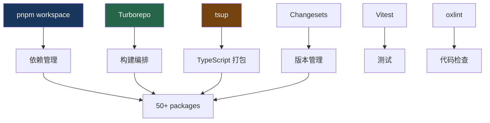
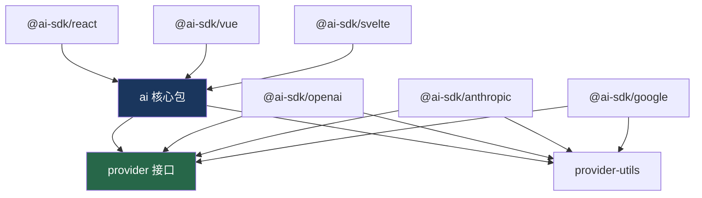

# 22. Monorepo 架构

> 源码位置: 仓库根目录 `ai/`

## 概述

Vercel AI SDK 是一个包含 50+ 包的 monorepo，使用 pnpm workspace 管理依赖、Turborepo 编排构建、tsup 打包、Changesets 管理版本。理解这个架构有助于理解代码组织和贡献流程。

## 底层原理

### 技术栈



### 包结构

```
ai/
├── packages/
│   ├── ai/                  ← 核心包（SDK 主入口）
│   ├── provider/            ← Provider 接口定义
│   ├── provider-utils/      ← Provider 工具函数
│   ├── react/               ← React hooks
│   ├── vue/                 ← Vue composables
│   ├── svelte/              ← Svelte stores
│   ├── angular/             ← Angular services
│   ├── openai/              ← OpenAI Provider
│   ├── anthropic/           ← Anthropic Provider
│   ├── google/              ← Google Provider
│   ├── amazon-bedrock/      ← AWS Bedrock Provider
│   ├── azure/               ← Azure Provider
│   ├── mistral/             ← Mistral Provider
│   ├── mcp/                 ← MCP 协议
│   ├── codemod/             ← 代码迁移工具
│   └── ...（50+ providers）
├── examples/                ← 示例项目
├── content/                 ← 文档内容
├── tools/                   ← 内部工具
├── pnpm-workspace.yaml      ← workspace 配置
├── turbo.json               ← Turborepo 配置
└── package.json             ← 根 package.json
```

### pnpm workspace

```yaml
# pnpm-workspace.yaml
packages:
  - 'packages/*'
  - 'examples/*'
  - 'tools/*'
```

```json
// 包之间的依赖（packages/react/package.json）
{
  "name": "@ai-sdk/react",
  "dependencies": {
    "ai": "workspace:*"  // 引用 workspace 内的包
  }
}
```

### Turborepo 构建编排

```jsonc
// turbo.json — 简化版
{
  "pipeline": {
    "build": {
      "dependsOn": ["^build"],  // 先构建依赖
      "outputs": ["dist/**"]
    },
    "test": {
      "dependsOn": ["build"]
    },
    "lint": {}
  }
}
```

**关键特性**：
- `^build`：拓扑排序，确保依赖先构建
- 缓存：相同输入不重复构建
- 并行：无依赖关系的包并行构建

### tsup 打包

```typescript
// packages/ai/tsup.config.ts — 典型配置
import { defineConfig } from 'tsup';

export default defineConfig({
  entry: ['src/index.ts'],
  format: ['cjs', 'esm'],     // 同时输出 CJS 和 ESM
  dts: true,                    // 生成类型声明
  sourcemap: true,
  clean: true,
  external: ['react', 'vue'],  // 外部依赖不打包
});
```

### Changesets 版本管理

```bash
# 开发流程
pnpm changeset              # 创建变更记录
# → 选择影响的包
# → 选择版本类型（patch/minor/major）
# → 写变更描述

pnpm changeset version      # 应用版本变更
pnpm changeset publish      # 发布到 npm
```

```markdown
<!-- .changeset/bright-crabs-float.md -->
---
'ai': minor
'@ai-sdk/react': patch
---

Added smoothStream transform for streaming output smoothing.
```

### 包依赖关系



### 与 Claude Code / Codex 的对比

| 维度 | Vercel AI SDK | Claude Code | Codex |
|------|--------------|-------------|-------|
| 语言 | TypeScript | TypeScript | Rust + TypeScript |
| 包管理 | pnpm workspace | npm（单包） | Cargo workspace |
| 构建工具 | Turborepo + tsup | tsc | cargo build |
| 版本管理 | Changesets | 手动 | 手动 |
| 包数量 | 50+ | 1 | ~5 |
| 测试框架 | Vitest | Vitest | Rust tests + Vitest |
| Lint | oxlint | ESLint | clippy + ESLint |

## 设计原因

- **Monorepo**：50+ Provider 共享接口和工具，统一管理更高效
- **pnpm**：比 npm/yarn 更快，workspace 协议更清晰
- **Turborepo**：增量构建和缓存，50+ 包的构建时间可控
- **tsup**：比 tsc 更快，自动处理 CJS/ESM 双格式
- **Changesets**：多包版本管理的标准方案，自动生成 CHANGELOG

## 关联知识点

- [多框架支持](/ui/multi-framework) — 多包协作的典型场景
- [Provider Registry](/provider/registry) — 50+ Provider 的统一管理
- [设计模式](/appendix/patterns) — Monorepo 中的设计模式
