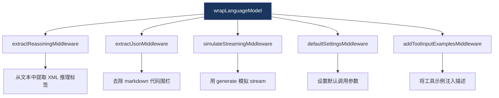

# 14. 内置中间件

> 源码位置: `packages/ai/src/middleware/`

## 概述

Vercel AI SDK 提供了 5 个内置中间件，覆盖了常见的模型调用增强需求：推理提取、JSON 提取、流式模拟、默认设置、工具示例注入。它们都实现 `LanguageModelMiddleware` 接口。

## 内置中间件一览



### 1. extractReasoningMiddleware

从模型输出中提取 XML 标签包裹的推理内容，将其暴露为独立的 `reasoning` 部分。

```typescript
// 用法
const model = wrapLanguageModel({
  model: openai('gpt-4o'),
  middleware: extractReasoningMiddleware({
    tagName: 'think',           // XML 标签名
    separator: '\n',            // 多段推理的分隔符
    startWithReasoning: false,  // 是否假设输出以推理开头
  }),
});

// 模型输出: "<think>让我想想...</think>答案是 42"
// 转换后:
//   reasoning: "让我想想..."
//   text: "答案是 42"
```

```typescript
// 核心实现 — wrapGenerate
wrapGenerate: async ({ doGenerate }) => {
  const { content, ...rest } = await doGenerate();
  
  for (const part of content) {
    if (part.type !== 'text') continue;
    
    const regexp = new RegExp(`<think>(.*?)</think>`, 'gs');
    const matches = Array.from(part.text.matchAll(regexp));
    
    if (matches.length) {
      const reasoningText = matches.map(m => m[1]).join('\n');
      // 移除推理标签后的文本
      let textWithoutReasoning = removeMatches(part.text, matches);
      
      transformedContent.push({ type: 'reasoning', text: reasoningText });
      transformedContent.push({ type: 'text', text: textWithoutReasoning });
    }
  }
  return { content: transformedContent, ...rest };
},

// wrapStream 版本：实时检测标签边界，流式分离推理和文本
```

### 2. extractJsonMiddleware

去除模型输出中的 markdown 代码围栏，提取纯 JSON。

```typescript
// 用法
const model = wrapLanguageModel({
  model: someModel,
  middleware: extractJsonMiddleware(),
});

// 模型输出: "```json\n{\"name\": \"test\"}\n```"
// 转换后: "{\"name\": \"test\"}"

// 自定义转换
const model = wrapLanguageModel({
  model: someModel,
  middleware: extractJsonMiddleware({
    transform: (text) => text.replace(/^[^{]*/, '').replace(/[^}]*$/, ''),
  }),
});
```

```typescript
// 核心实现
function defaultTransform(text: string): string {
  return text
    .replace(/^```(?:json)?\s*\n?/, '')  // 去除开头围栏
    .replace(/\n?```\s*$/, '')            // 去除结尾围栏
    .trim();
}
```

### 3. simulateStreamingMiddleware

将不支持流式的模型（或需要完整响应的场景）模拟为流式输出。

```typescript
// 用法
const model = wrapLanguageModel({
  model: someNonStreamingModel,
  middleware: simulateStreamingMiddleware(),
});

// 现在可以用 streamText 调用这个模型了
const result = streamText({ model, prompt: 'Hello' });
```

```typescript
// 核心实现
wrapStream: async ({ doGenerate }) => {
  const result = await doGenerate(); // 用 generate 获取完整结果
  
  // 将完整结果转换为流 parts
  const simulatedStream = new ReadableStream({
    start(controller) {
      controller.enqueue({ type: 'stream-start', warnings: result.warnings });
      
      for (const part of result.content) {
        if (part.type === 'text') {
          controller.enqueue({ type: 'text-start', id: String(id) });
          controller.enqueue({ type: 'text-delta', id: String(id), delta: part.text });
          controller.enqueue({ type: 'text-end', id: String(id++) });
        }
        // ... 处理其他类型
      }
      
      controller.enqueue({ type: 'finish', finishReason: result.finishReason, usage: result.usage });
      controller.close();
    },
  });
  
  return { stream: simulatedStream, request: result.request, response: result.response };
},
```

### 4. defaultSettingsMiddleware

为模型调用设置默认参数，调用时的参数会覆盖默认值。

```typescript
// 用法
const model = wrapLanguageModel({
  model: openai('gpt-4o'),
  middleware: defaultSettingsMiddleware({
    settings: {
      temperature: 0.7,
      maxOutputTokens: 4096,
      topP: 0.9,
    },
  }),
});

// 调用时可以覆盖
const result = await generateText({
  model,
  prompt: 'Hello',
  temperature: 0.3, // 覆盖默认的 0.7
});
```

```typescript
// 核心实现
transformParams: async ({ params }) => {
  return mergeObjects(settings, params); // settings 是默认值，params 覆盖
},
```

### 5. addToolInputExamplesMiddleware

将工具的 `inputExamples` 属性序列化到工具描述中（用于不支持 inputExamples 的 Provider）。

```typescript
// 用法
const model = wrapLanguageModel({
  model: someModel,
  middleware: addToolInputExamplesMiddleware({
    prefix: 'Input Examples:',
    remove: true, // 注入描述后移除 inputExamples 属性
  }),
});

// 工具描述从:
//   "获取天气信息"
// 变为:
//   "获取天气信息\n\nInput Examples:\n{\"city\":\"北京\"}\n{\"city\":\"上海\"}"
```

### 中间件组合示例

```typescript
const model = wrapLanguageModel({
  model: openai('gpt-4o'),
  middleware: [
    defaultSettingsMiddleware({ settings: { temperature: 0.7 } }),
    extractReasoningMiddleware({ tagName: 'think' }),
    addToolInputExamplesMiddleware(),
  ],
});
// 执行顺序：
// transformParams: default → extractReasoning → addToolInput
// wrapGenerate: default(extractReasoning(addToolInput(model)))
```

### 与 Claude Code / Codex 的对比

| 维度 | 内置中间件 | Claude Code | Codex |
|------|----------|-------------|-------|
| 推理提取 | extractReasoningMiddleware | 模型原生支持 | 无 |
| JSON 提取 | extractJsonMiddleware | 无 | 无 |
| 流式模拟 | simulateStreamingMiddleware | 无 | 无 |
| 默认设置 | defaultSettingsMiddleware | 硬编码 | 配置文件 |
| 工具示例 | addToolInputExamplesMiddleware | 无 | 无 |

## 设计原因

- **可组合**：每个中间件解决一个问题，可以自由组合
- **Provider 无关**：中间件在 SDK 层工作，不依赖特定 Provider
- **渐进增强**：不需要的中间件不会影响性能
- **流式感知**：每个中间件同时处理 generate 和 stream 两种模式

## 关联知识点

- [wrapLanguageModel](/middleware/wrap-model) — 中间件系统核心
- [LanguageModel 接口](/provider/language-model-interface) — 被包装的接口
- [Web Streams 基础](/streaming/web-streams) — 流式中间件的基础
