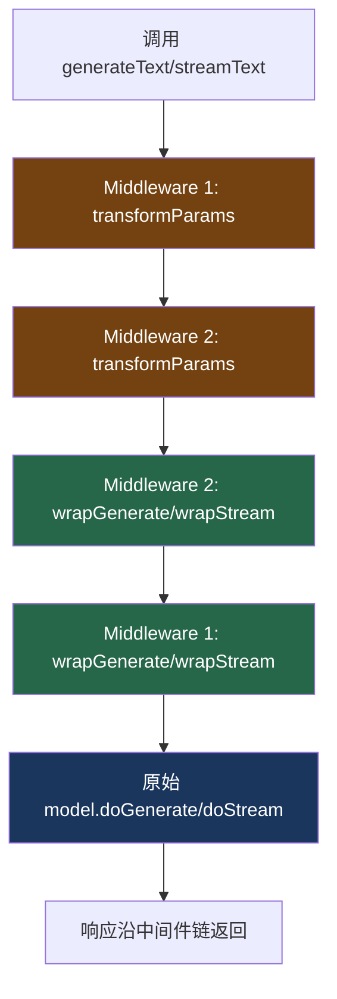

# 13. wrapLanguageModel

> 源码位置: `packages/ai/src/middleware/wrap-language-model.ts`

## 概述

`wrapLanguageModel` 是 Vercel AI SDK 的中间件系统核心。它接受一个 LanguageModel 和一个或多个中间件，返回一个新的 LanguageModel，在调用前后插入自定义逻辑。支持参数变换（transformParams）、生成包装（wrapGenerate）、流包装（wrapStream）。

## 底层原理

### 中间件架构



### 核心实现

```typescript
// wrap-language-model.ts

const wrapLanguageModel = ({
  model: inputModel,
  middleware: middlewareArg,
  modelId,
  providerId,
}) => {
  const model = asLanguageModelV4(inputModel); // 自动版本适配
  
  // 关键：reverse() — 第一个中间件最外层
  return [...asArray(middlewareArg)]
    .reverse()
    .reduce((wrappedModel, middleware) => {
      return doWrap({ model: wrappedModel, middleware, modelId, providerId });
    }, model);
};
```

### doWrap：单层包装

```typescript
const doWrap = ({ model, middleware, modelId, providerId }) => {
  const { transformParams, wrapGenerate, wrapStream, 
          overrideProvider, overrideModelId, overrideSupportedUrls } = middleware;

  async function doTransform({ params, type }) {
    return transformParams
      ? await transformParams({ params, type, model })
      : params;
  }

  return {
    specificationVersion: 'v4',
    
    // 元数据可被中间件覆盖
    provider: providerId ?? overrideProvider?.({ model }) ?? model.provider,
    modelId: modelId ?? overrideModelId?.({ model }) ?? model.modelId,
    supportedUrls: overrideSupportedUrls?.({ model }) ?? model.supportedUrls,

    async doGenerate(params) {
      const transformedParams = await doTransform({ params, type: 'generate' });
      const doGenerate = async () => model.doGenerate(transformedParams);
      const doStream = async () => model.doStream(transformedParams);
      
      return wrapGenerate
        ? wrapGenerate({ doGenerate, doStream, params: transformedParams, model })
        : doGenerate();
    },

    async doStream(params) {
      const transformedParams = await doTransform({ params, type: 'stream' });
      const doGenerate = async () => model.doGenerate(transformedParams);
      const doStream = async () => model.doStream(transformedParams);
      
      return wrapStream
        ? wrapStream({ doGenerate, doStream, params: transformedParams, model })
        : doStream();
    },
  };
};
```

### 中间件接口

```typescript
type LanguageModelMiddleware = {
  specificationVersion?: 'v4';
  
  // 参数变换：在调用模型前修改参数
  transformParams?: (options: {
    params: LanguageModelV4CallOptions;
    type: 'generate' | 'stream';
    model: LanguageModelV4;
  }) => PromiseLike<LanguageModelV4CallOptions>;
  
  // 生成包装：包装 doGenerate 调用
  wrapGenerate?: (options: {
    doGenerate: () => Promise<GenerateResult>;
    doStream: () => Promise<StreamResult>;  // 也可以在 generate 中用 stream
    params: LanguageModelV4CallOptions;
    model: LanguageModelV4;
  }) => Promise<GenerateResult>;
  
  // 流包装：包装 doStream 调用
  wrapStream?: (options: {
    doGenerate: () => Promise<GenerateResult>;
    doStream: () => Promise<StreamResult>;
    params: LanguageModelV4CallOptions;
    model: LanguageModelV4;
  }) => Promise<StreamResult>;
  
  // 元数据覆盖
  overrideProvider?: (options: { model: LanguageModelV4 }) => string;
  overrideModelId?: (options: { model: LanguageModelV4 }) => string;
  overrideSupportedUrls?: (options: { model: LanguageModelV4 }) => Record<string, RegExp[]>;
};
```

### 中间件组合顺序

```typescript
// 中间件数组 [A, B, C] 的执行顺序：
// transformParams: A → B → C（正序）
// wrapGenerate/wrapStream: A → B → C → model（A 最外层）

const model = wrapLanguageModel({
  model: openai('gpt-4o'),
  middleware: [logging, caching, rateLimit],
});

// 等价于：
// logging.transformParams → caching.transformParams → rateLimit.transformParams
// logging.wrapGenerate(
//   caching.wrapGenerate(
//     rateLimit.wrapGenerate(
//       model.doGenerate
//     )
//   )
// )
```

### 使用示例

```typescript
// 自定义中间件：添加日志
const loggingMiddleware: LanguageModelMiddleware = {
  transformParams: async ({ params, type }) => {
    console.log(`[${type}] 参数:`, params.prompt.length, '条消息');
    return params;
  },
  wrapGenerate: async ({ doGenerate, params }) => {
    const start = Date.now();
    const result = await doGenerate();
    console.log(`生成耗时: ${Date.now() - start}ms`);
    return result;
  },
};

const model = wrapLanguageModel({
  model: openai('gpt-4o'),
  middleware: [loggingMiddleware, extractReasoningMiddleware({ tagName: 'think' })],
});
```

### 与 Claude Code / Codex 的对比

| 维度 | wrapLanguageModel | Claude Code | Codex |
|------|------------------|-------------|-------|
| 中间件模式 | 装饰器/洋葱模型 | Hooks 系统 | 无 |
| 参数变换 | transformParams | 无 | 无 |
| 生成包装 | wrapGenerate/wrapStream | 无 | 无 |
| 组合方式 | 数组（reverse 顺序） | 注册回调 | 无 |
| 元数据覆盖 | overrideProvider/ModelId | 无 | 无 |

## 设计原因

- **装饰器模式**：返回新的 LanguageModelV4，对调用者透明
- **reverse 顺序**：第一个中间件最外层，符合"先声明先执行"的直觉
- **doGenerate + doStream 都可用**：wrapStream 中可以调用 doGenerate（如 simulateStreamingMiddleware）
- **版本自动适配**：asLanguageModelV4 确保旧版 Provider 也能使用中间件

## 关联知识点

- [内置中间件](/middleware/builtin) — 具体中间件实现
- [LanguageModel 接口](/provider/language-model-interface) — 被包装的接口
- [版本兼容](/provider/version-compat) — asLanguageModelV4
