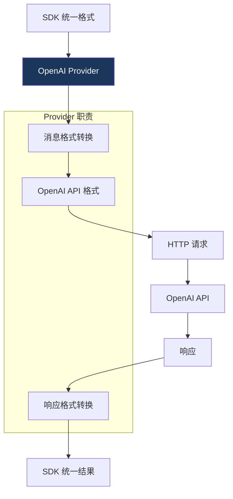

# 7. OpenAI Provider 适配器

> 源码位置: `packages/openai/src/`

## 概述

OpenAI Provider 是 Vercel AI SDK 中最典型的 Provider 实现。它展示了如何将 OpenAI 的 API 格式转换为 SDK 统一的 `LanguageModelV4` 接口，包括消息格式转换、工具调用处理、流式响应解析等。

## 底层原理

### 适配器架构



### Provider 工厂函数

```typescript
// openai-provider.ts — 简化版

function createOpenAI(options?: { apiKey?: string; baseURL?: string }) {
  const provider = function (modelId: string) {
    return provider.languageModel(modelId);
  };
  
  provider.languageModel = (modelId: string): LanguageModelV4 => {
    return new OpenAIChatLanguageModel(modelId, {
      apiKey: options?.apiKey ?? process.env.OPENAI_API_KEY,
      baseURL: options?.baseURL ?? 'https://api.openai.com/v1',
    });
  };
  
  provider.embedding = (modelId: string) => { /* ... */ };
  provider.image = (modelId: string) => { /* ... */ };
  
  return provider;
}
```

### 消息格式转换

```typescript
// SDK 统一格式 → OpenAI 格式

// SDK 格式（LanguageModelV4Prompt）
const sdkMessages = [
  { role: 'system', content: '你是一个助手' },
  { role: 'user', content: [
    { type: 'text', text: '描述这张图片' },
    { type: 'file', mediaType: 'image/png', data: base64Data },
  ]},
];

// 转换后的 OpenAI 格式
const openaiMessages = [
  { role: 'system', content: '你是一个助手' },
  { role: 'user', content: [
    { type: 'text', text: '描述这张图片' },
    { type: 'image_url', image_url: { url: 'data:image/png;base64,...' } },
  ]},
];
```

### 工具调用处理

```typescript
// SDK 工具定义 → OpenAI function calling 格式

// SDK 格式
const sdkTools = [{
  type: 'function',
  name: 'get_weather',
  description: '获取天气',
  parameters: { type: 'object', properties: { city: { type: 'string' } } },
}];

// OpenAI 格式
const openaiTools = [{
  type: 'function',
  function: {
    name: 'get_weather',
    description: '获取天气',
    parameters: { type: 'object', properties: { city: { type: 'string' } } },
  },
}];

// 响应中的工具调用解析
// OpenAI 返回 → SDK 统一格式
function parseToolCalls(openaiResponse) {
  return openaiResponse.choices[0].message.tool_calls?.map(tc => ({
    type: 'tool-call',
    toolCallId: tc.id,
    toolName: tc.function.name,
    args: JSON.parse(tc.function.arguments),
  }));
}
```

### doGenerate 实现模式

```typescript
// OpenAI Provider 的 doGenerate — 简化版

class OpenAIChatLanguageModel implements LanguageModelV4 {
  readonly specificationVersion = 'v4';
  readonly provider = 'openai';
  
  async doGenerate(options: LanguageModelV4CallOptions) {
    // 1. 转换参数
    const body = {
      model: this.modelId,
      messages: convertToOpenAIMessages(options.prompt),
      tools: options.tools ? convertToOpenAITools(options.tools) : undefined,
      temperature: options.temperature,
      max_tokens: options.maxOutputTokens,
      // ... 其他参数映射
    };
    
    // 2. 发送请求
    const response = await fetch(`${this.baseURL}/chat/completions`, {
      method: 'POST',
      headers: { 'Authorization': `Bearer ${this.apiKey}` },
      body: JSON.stringify(body),
      signal: options.abortSignal,
    });
    
    // 3. 转换响应
    const json = await response.json();
    return {
      content: extractContent(json),
      finishReason: mapFinishReason(json.choices[0].finish_reason),
      usage: { inputTokens: json.usage.prompt_tokens, outputTokens: json.usage.completion_tokens },
      response: { id: json.id, modelId: json.model },
    };
  }
}
```

### doStream 实现模式

```typescript
async doStream(options: LanguageModelV4CallOptions) {
  const response = await fetch(`${this.baseURL}/chat/completions`, {
    method: 'POST',
    body: JSON.stringify({ ...body, stream: true }),
    signal: options.abortSignal,
  });
  
  return {
    stream: response.body
      .pipeThrough(new TextDecoderStream())
      .pipeThrough(parseSSEStream())        // 解析 SSE
      .pipeThrough(mapToStreamParts()),      // 转换为 SDK 流 parts
    response: { id: responseId, modelId: this.modelId },
  };
}
```

### 与 Claude Code / Codex 的对比

| 维度 | OpenAI Provider | Claude Code | Codex |
|------|----------------|-------------|-------|
| API 调用 | 通过 Provider 抽象 | 直接调用 Anthropic SDK | 直接调用 OpenAI SDK |
| 消息转换 | 双向转换层 | 无需转换 | 无需转换 |
| 流式解析 | TransformStream 管道 | SDK 内置 | SDK 内置 |
| 工具格式 | SDK 统一 → OpenAI 格式 | Anthropic 原生格式 | OpenAI 原生格式 |
| 错误处理 | 统一错误类型 | 自定义重试 | 自定义重试 |

## 设计原因

- **适配器模式**：每个 Provider 只负责格式转换，不涉及业务逻辑
- **"do" 前缀**：doGenerate/doStream 是 Provider 的内部方法，不应被直接调用
- **工厂函数**：`createOpenAI()` 返回可调用对象，支持 `openai('gpt-4o')` 简写
- **关注点分离**：Provider 不处理重试、遥测、中间件——这些由 SDK 核心处理

## 关联知识点

- [LanguageModel 接口](/provider/language-model-interface) — Provider 实现的接口
- [Provider Registry](/provider/registry) — Provider 的注册和查找
- [版本兼容](/provider/version-compat) — 旧版 Provider 适配
