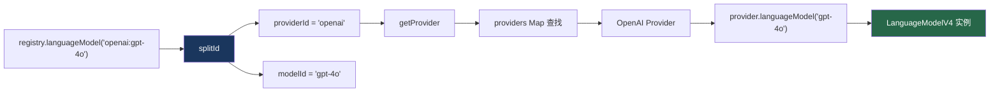

# 6. Provider Registry

> 源码位置: `packages/ai/src/registry/provider-registry.ts`

## 概述

Provider Registry 是一个注册表模式实现，允许通过 `"provider:model"` 字符串语法查找模型。它支持类型安全的 Provider 注册和查找，是多 Provider 应用的核心基础设施。

## 底层原理

### 核心流程



### 创建 Registry

```typescript
// provider-registry.ts

function createProviderRegistry<PROVIDERS extends Record<string, Provider>>(
  providers: PROVIDERS,
): ProviderRegistryProvider<PROVIDERS> {
  const registry = new DefaultProviderRegistry<PROVIDERS>();
  for (const [id, provider] of Object.entries(providers)) {
    registry.registerProvider({ id, provider });
  }
  return registry;
}

// 使用示例
const registry = createProviderRegistry({
  openai: createOpenAI({ apiKey: '...' }),
  anthropic: createAnthropic({ apiKey: '...' }),
  google: createGoogleGenerativeAI({ apiKey: '...' }),
});

// 类型安全：只能使用已注册的 provider 名称
const model = registry.languageModel('openai:gpt-4o');     // ✅
const model2 = registry.languageModel('anthropic:claude-3'); // ✅
// registry.languageModel('unknown:model');                  // ❌ 类型错误
```

### splitId：解析 "provider:model" 语法

```typescript
// DefaultProviderRegistry

private splitId(id: string, modelType: string): [string, string] {
  const index = id.indexOf(this.separator); // 默认 separator = ':'
  
  if (index === -1) {
    throw new NoSuchModelError({
      modelId: id,
      modelType,
      message: `Invalid ${modelType} id for registry: ${id} ` +
        `(must be in the format "providerId:modelId")`,
    });
  }
  
  return [id.slice(0, index), id.slice(index + this.separator.length)];
}

// "openai:gpt-4o" → ["openai", "gpt-4o"]
// "anthropic:claude-3-opus-20240229" → ["anthropic", "claude-3-opus-20240229"]
```

### DefaultProviderRegistry 完整结构

```typescript
class DefaultProviderRegistry<PROVIDERS extends Record<string, Provider>> {
  private providers: Record<string, Provider> = {};
  private separator: string;

  constructor({ separator = ':' } = {}) {
    this.separator = separator;
  }

  registerProvider({ id, provider }) {
    this.providers[id] = provider;
  }

  private getProvider(id: string): Provider {
    const provider = this.providers[id];
    if (!provider) {
      throw new NoSuchProviderError({ providerId: id });
    }
    return provider;
  }

  // 支持多种模型类型
  languageModel(id) {
    const [providerId, modelId] = this.splitId(id, 'languageModel');
    return this.getProvider(providerId).languageModel(modelId);
  }

  embeddingModel(id) { /* 同上模式 */ }
  imageModel(id) { /* 同上模式 */ }
  transcriptionModel(id) { /* 同上模式 */ }
  speechModel(id) { /* 同上模式 */ }
  rerankingModel(id) { /* 同上模式 */ }
  videoModel(id) { /* 同上模式 */ }
  
  // 非模型资源
  files(providerId) { return this.getProvider(providerId).files?.(); }
  skills(providerId) { return this.getProvider(providerId).skills?.(); }
}
```

### 支持的模型类型

| 方法 | 返回类型 | 用途 |
|------|---------|------|
| `languageModel()` | LanguageModelV4 | 文本生成 |
| `embeddingModel()` | EmbeddingModel | 向量嵌入 |
| `imageModel()` | ImageModel | 图像生成 |
| `transcriptionModel()` | TranscriptionModel | 语音转文字 |
| `speechModel()` | SpeechModel | 文字转语音 |
| `rerankingModel()` | RerankingModel | 重排序 |
| `videoModel()` | VideoModel | 视频生成 |

### 与 Claude Code / Codex 的对比

| 维度 | Provider Registry | Claude Code | Codex |
|------|------------------|-------------|-------|
| Provider 数量 | 50+ | 1（Anthropic） | 少数几个 |
| 查找方式 | "provider:model" 字符串 | 硬编码 | 配置文件 |
| 类型安全 | 泛型推导 | 无 | 无 |
| 动态注册 | registerProvider | 无 | 无 |
| 多模型类型 | 7 种 | 仅语言模型 | 仅语言模型 |

## 设计原因

- **字符串 ID**：`"openai:gpt-4o"` 比对象引用更适合配置文件和环境变量
- **类型安全**：泛型确保只能使用已注册的 Provider 名称
- **统一入口**：一个 Registry 管理所有类型的模型，简化依赖注入
- **分离关注点**：Registry 只负责查找，不负责创建或配置 Provider

## 关联知识点

- [LanguageModel 接口](/provider/language-model-interface) — Registry 返回的类型
- [OpenAI 适配器](/provider/openai-adapter) — 具体 Provider 实现
- [版本兼容](/provider/version-compat) — 旧版 Provider 的适配
