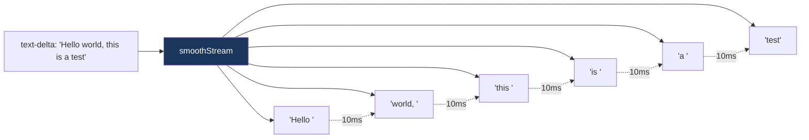

# 10. smoothStream

> 源码位置: `packages/ai/src/generate-text/smooth-stream.ts`

## 概述

`smoothStream` 是一个 TransformStream 工厂，用于平滑流式文本输出。它解决的问题是：模型可能一次性输出大块文本（尤其是缓存命中时），导致 UI 上文字突然出现。smoothStream 将大块文本拆分为小 chunk，每个 chunk 之间加入延迟。

## 底层原理

### 工作流程



### 核心实现

```typescript
// smooth-stream.ts

const CHUNKING_REGEXPS = {
  word: /\S+\s+/m,   // 按单词（空格分隔）
  line: /\n+/m,       // 按行（换行分隔）
};

function smoothStream<TOOLS>({
  delayInMs = 10,      // 每个 chunk 之间的延迟
  chunking = 'word',   // 分块策略
} = {}) {
  let detectChunk: ChunkDetector;
  
  // 根据 chunking 参数选择检测器
  if (typeof chunking === 'object' && 'segment' in chunking) {
    // Intl.Segmenter（推荐用于 CJK 语言）
    const segmenter = chunking;
    detectChunk = (buffer) => {
      const first = segmenter.segment(buffer)[Symbol.iterator]().next().value;
      return first?.segment || null;
    };
  } else if (typeof chunking === 'function') {
    // 自定义 ChunkDetector
    detectChunk = chunking;
  } else {
    // 字符串或 RegExp
    const regex = typeof chunking === 'string' ? CHUNKING_REGEXPS[chunking] : chunking;
    detectChunk = (buffer) => {
      const match = regex.exec(buffer);
      return match ? buffer.slice(0, match.index) + match[0] : null;
    };
  }

  return () => {
    let buffer = '';
    let type: 'text-delta' | 'reasoning-delta' | undefined;

    return new TransformStream({
      async transform(chunk, controller) {
        // 非文本 chunk 直接透传
        if (chunk.type !== 'text-delta' && chunk.type !== 'reasoning-delta') {
          flushBuffer(controller);
          controller.enqueue(chunk);
          return;
        }

        buffer += chunk.text;
        type = chunk.type;

        // 循环提取 chunk 并输出
        let match;
        while ((match = detectChunk(buffer)) != null) {
          controller.enqueue({ type, text: match, id: chunk.id });
          buffer = buffer.slice(match.length);
          await delay(delayInMs); // 关键：每个 chunk 之间加延迟
        }
      },
    });
  };
}
```

### 分块策略对比

| 策略 | 正则 | 适用场景 | 示例 |
|------|------|---------|------|
| `'word'` | `/\S+\s+/m` | 英文等空格分隔语言 | `"Hello "`, `"world "` |
| `'line'` | `/\n+/m` | 代码输出 | 整行输出 |
| `RegExp` | 自定义 | 特殊分隔需求 | 按句号分隔 |
| `Intl.Segmenter` | - | CJK 语言（中日韩） | 按字/词分隔 |
| `ChunkDetector` | - | 完全自定义 | 任意逻辑 |

### CJK 语言支持

```typescript
// 中文/日文/韩文没有空格分隔，需要 Intl.Segmenter
const result = streamText({
  model: openai('gpt-4o'),
  prompt: '用中文写一首诗',
  experimental_transform: smoothStream({
    chunking: new Intl.Segmenter('zh', { granularity: 'word' }),
  }),
});
```

### 使用方式

```typescript
// 基本用法
const result = streamText({
  model: openai('gpt-4o'),
  prompt: 'Write a story',
  experimental_transform: smoothStream(), // 默认：word 分块，10ms 延迟
});

// 自定义延迟
const result = streamText({
  model: openai('gpt-4o'),
  prompt: 'Write code',
  experimental_transform: smoothStream({
    delayInMs: 20,    // 更慢的输出
    chunking: 'line', // 按行输出（适合代码）
  }),
});

// 禁用延迟（只做分块）
const result = streamText({
  model: openai('gpt-4o'),
  prompt: 'Quick response',
  experimental_transform: smoothStream({ delayInMs: null }),
});
```

### 与 Claude Code / Codex 的对比

| 维度 | smoothStream | Claude Code | Codex |
|------|-------------|-------------|-------|
| 输出平滑 | 显式 TransformStream | 无（Ink 自动渲染） | 无（Ratatui 自动渲染） |
| 分块策略 | 可配置（word/line/regex/segmenter） | 不适用 | 不适用 |
| 延迟控制 | delayInMs 参数 | 不适用 | 不适用 |
| CJK 支持 | Intl.Segmenter | 不适用 | 不适用 |

## 设计原因

- **可选插件**：不是所有场景都需要平滑，作为 transform 参数提供
- **多策略**：不同语言和场景需要不同的分块策略
- **Intl.Segmenter**：利用浏览器原生能力处理 CJK 分词
- **延迟可配**：10ms 是经验值，用户可以根据 UX 需求调整

## 关联知识点

- [Web Streams 基础](/streaming/web-streams) — TransformStream 原理
- [streamText 流式循环](/agent/stream-text-loop) — smoothStream 的使用场景
- [SSE 传输](/streaming/sse-transport) — 平滑后的流如何发送到客户端
