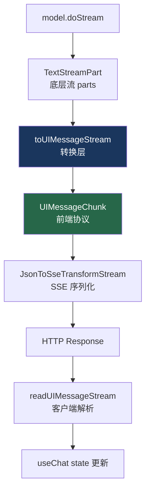

# 12. UIMessageStream 协议

> 源码位置: `packages/ai/src/ui-message-stream/`

## 概述

UIMessageStream 是 Vercel AI SDK 定义的前端消息流协议。它将 `streamText` 的底层流 parts（text-delta、tool-call 等）转换为前端 UI 可直接消费的 chunk 格式，是服务端和客户端之间的桥梁。

## 底层原理

### 协议层次



### createUIMessageStream

```typescript
// create-ui-message-stream.ts — 核心 API

function createUIMessageStream<UI_MESSAGE extends UIMessage>({
  execute,       // 写入流的函数
  onError,       // 错误处理
  originalMessages, // 原始消息（用于持久化模式）
  onStepFinish,  // 步骤完成回调
  onFinish,      // 完成回调
  generateId,    // ID 生成器
}): ReadableStream<UIMessageChunk> {
  let controller: ReadableStreamDefaultController;
  const ongoingStreamPromises: Promise<void>[] = [];

  const stream = new ReadableStream({
    start(controllerArg) { controller = controllerArg; },
  });

  // 执行用户提供的写入逻辑
  const result = execute({
    writer: {
      write(part) { controller.enqueue(part); },
      merge(stream) {
        // 合并另一个流（支持嵌套 Agent 场景）
        ongoingStreamPromises.push(
          (async () => {
            const reader = stream.getReader();
            while (true) {
              const { done, value } = await reader.read();
              if (done) break;
              controller.enqueue(value);
            }
          })()
        );
      },
      onError,
    },
  });

  // 等待所有合并的流完成后关闭
  waitForStreams.finally(() => controller.close());
  
  return handleUIMessageStreamFinish({ stream, ... });
}
```

### UIMessageStreamWriter

```typescript
// ui-message-stream-writer.ts

interface UIMessageStreamWriter<UI_MESSAGE extends UIMessage> {
  write(part: UIMessageChunk): void;     // 写入单个 chunk
  merge(stream: ReadableStream): void;   // 合并另一个流
  onError: ErrorHandler | undefined;     // 错误处理器
}
```

### UIMessageChunk 类型

```typescript
// 主要的 chunk 类型
type UIMessageChunk =
  | { type: 'text-start'; id: string }
  | { type: 'text-delta'; id: string; delta: string }
  | { type: 'text-end'; id: string }
  | { type: 'reasoning-start'; id: string }
  | { type: 'reasoning-delta'; id: string; delta: string }
  | { type: 'reasoning-end'; id: string }
  | { type: 'tool-call-start'; toolCallId: string; toolName: string }
  | { type: 'tool-call-input-delta'; toolCallId: string; delta: string }
  | { type: 'tool-call-end'; toolCallId: string }
  | { type: 'tool-result'; toolCallId: string; result: unknown }
  | { type: 'source-url'; sourceId: string; url: string; title?: string }
  | { type: 'file'; mediaType: string; url: string }
  | { type: 'start-step'; messageId: string }
  | { type: 'finish-step'; messageId: string; metadata?: unknown }
  | { type: 'start'; messageId: string }
  | { type: 'finish'; messageId: string; metadata?: unknown }
  | { type: 'error'; errorText: string }
  | { type: 'metadata'; metadata: unknown };
```

### streamText → UIMessageStream 转换

```typescript
// DefaultStreamTextResult.toUIMessageStream — 简化版

toUIMessageStream({ sendReasoning = true, sendSources = false }) {
  return this.fullStream.pipeThrough(new TransformStream({
    transform(part, controller) {
      switch (part.type) {
        case 'text-delta':
          controller.enqueue({ type: 'text-delta', id: part.id, delta: part.text });
          break;
        case 'tool-call':
          controller.enqueue({
            type: 'tool-call-start',
            toolCallId: part.toolCallId,
            toolName: part.toolName,
          });
          break;
        case 'tool-result':
          controller.enqueue({
            type: 'tool-result',
            toolCallId: part.toolCallId,
            result: part.result,
          });
          break;
        // ... 其他类型映射
      }
    },
  }));
}
```

### 典型使用模式

```typescript
// 模式 1：streamText 自动转换（最常用）
const result = streamText({ model, messages });
return result.toUIMessageStreamResponse();

// 模式 2：手动创建 UIMessageStream
return createUIMessageStreamResponse({
  stream: createUIMessageStream({
    execute: async ({ writer }) => {
      // 手动写入
      writer.write({ type: 'text-start', id: '0' });
      writer.write({ type: 'text-delta', id: '0', delta: 'Hello' });
      writer.write({ type: 'text-end', id: '0' });
      
      // 或合并 streamText 的流
      const result = streamText({ model, messages });
      writer.merge(result.toUIMessageStream());
    },
  }),
});

// 模式 3：多 Agent 合并
return createUIMessageStreamResponse({
  stream: createUIMessageStream({
    execute: async ({ writer }) => {
      const agent1 = streamText({ model: openai('gpt-4o'), ... });
      const agent2 = streamText({ model: anthropic('claude-3'), ... });
      writer.merge(agent1.toUIMessageStream());
      writer.merge(agent2.toUIMessageStream());
    },
  }),
});
```

### 与 Claude Code / Codex 的对比

| 维度 | UIMessageStream | Claude Code | Codex |
|------|----------------|-------------|-------|
| 协议类型 | 自定义 JSON chunk | 无（直接渲染） | 无（直接渲染） |
| 传输方式 | SSE over HTTP | 进程内 | 进程内 |
| 消息类型 | 20+ 种 chunk 类型 | 不适用 | 不适用 |
| 流合并 | writer.merge() | 不适用 | 不适用 |
| 持久化 | onStepFinish/onFinish | 不适用 | 不适用 |

## 设计原因

- **协议分层**：底层 TextStreamPart 和前端 UIMessageChunk 分离，各自演进
- **writer.merge()**：支持多个 streamText 结果合并到一个响应流
- **chunk 类型丰富**：不只是文本，还有工具调用、推理、来源等
- **持久化钩子**：onStepFinish/onFinish 让服务端可以在流式过程中保存中间状态

## 关联知识点

- [SSE 传输](/streaming/sse-transport) — UIMessageStream 的传输层
- [useChat](/ui/use-chat) — 客户端消费 UIMessageStream
- [streamText 流式循环](/agent/stream-text-loop) — UIMessageStream 的数据源
