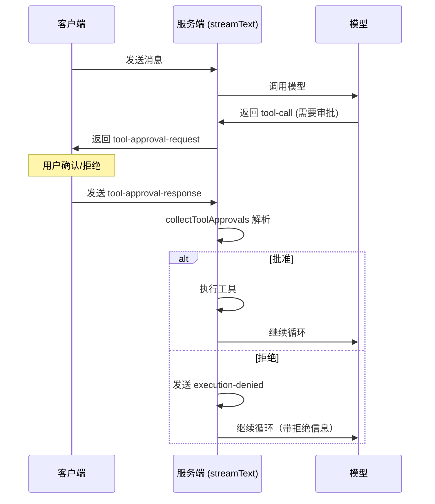

# 16. 工具审批机制

> 源码位置: `packages/ai/src/generate-text/collect-tool-approvals.ts`

## 概述

工具审批（Tool Approval）允许在工具执行前插入人工确认步骤。当模型调用需要审批的工具时，循环暂停，返回审批请求给客户端。客户端确认后，将审批响应作为消息发回，循环继续执行。

## 底层原理

### 审批流程



### collectToolApprovals 源码

```typescript
// collect-tool-approvals.ts

function collectToolApprovals<TOOLS>({ messages }) {
  const lastMessage = messages.at(-1);
  
  // 只处理最后一条 tool 消息
  if (lastMessage?.role !== 'tool') {
    return { approvedToolApprovals: [], deniedToolApprovals: [] };
  }

  // 1. 收集所有 tool-call（从 assistant 消息中）
  const toolCallsByToolCallId = {};
  for (const message of messages) {
    if (message.role === 'assistant') {
      for (const part of message.content) {
        if (part.type === 'tool-call') {
          toolCallsByToolCallId[part.toolCallId] = part;
        }
      }
    }
  }

  // 2. 收集所有 approval-request（从 assistant 消息中）
  const approvalRequestsByApprovalId = {};
  for (const message of messages) {
    if (message.role === 'assistant') {
      for (const part of message.content) {
        if (part.type === 'tool-approval-request') {
          approvalRequestsByApprovalId[part.approvalId] = part;
        }
      }
    }
  }

  // 3. 解析最后一条 tool 消息中的 approval-response
  const approvedToolApprovals = [];
  const deniedToolApprovals = [];
  
  for (const approvalResponse of lastMessage.content) {
    if (approvalResponse.type !== 'tool-approval-response') continue;
    
    const approvalRequest = approvalRequestsByApprovalId[approvalResponse.approvalId];
    const toolCall = toolCallsByToolCallId[approvalRequest.toolCallId];
    
    if (approvalResponse.approved) {
      approvedToolApprovals.push({ approvalRequest, approvalResponse, toolCall });
    } else {
      deniedToolApprovals.push({ approvalRequest, approvalResponse, toolCall });
    }
  }

  return { approvedToolApprovals, deniedToolApprovals };
}
```

### 在 streamText 中的集成

```typescript
// stream-text.ts — 初始化阶段

const { approvedToolApprovals, deniedToolApprovals } = 
  collectToolApprovals({ messages: initialMessages });

// 处理拒绝的工具
for (const toolApproval of deniedToolApprovals) {
  controller.enqueue({
    type: 'tool-output-denied',
    toolCallId: toolApproval.toolCall.toolCallId,
    toolName: toolApproval.toolCall.toolName,
  });
}

// 执行批准的工具
await Promise.all(
  approvedToolApprovals.map(async (toolApproval) => {
    const result = await executeToolCall({
      toolCall: toolApproval.toolCall,
      tools,
      context,
    });
    if (result) controller.enqueue(result);
  })
);

// 将拒绝信息作为 tool-result 发送给模型
for (const toolApproval of deniedToolApprovals) {
  initialResponseMessages.push({
    role: 'tool',
    content: [{
      type: 'tool-result',
      toolCallId: toolApproval.toolCall.toolCallId,
      output: {
        type: 'execution-denied',
        reason: toolApproval.approvalResponse.reason,
      },
    }],
  });
}
```

### 客户端使用示例

```typescript
// 服务端：定义需要审批的工具
const tools = {
  deleteFile: tool({
    description: '删除文件',
    parameters: z.object({ path: z.string() }),
    experimental_approvalRequired: true, // 标记需要审批
    execute: async ({ path }) => {
      await fs.unlink(path);
      return { deleted: path };
    },
  }),
};

// 客户端：处理审批请求
const { messages, addToolResult } = useChat();

// 当收到 tool-approval-request 时
for (const msg of messages) {
  for (const part of msg.parts) {
    if (part.type === 'tool-approval-request') {
      // 显示确认对话框
      const approved = await showConfirmDialog(
        `确认执行 ${part.toolName}？参数: ${JSON.stringify(part.args)}`
      );
      // 发送审批响应
      addToolResult({
        type: 'tool-approval-response',
        approvalId: part.approvalId,
        approved,
        reason: approved ? undefined : '用户拒绝',
      });
    }
  }
}
```

### 与 Claude Code / Codex 的对比

| 维度 | Vercel AI SDK | Claude Code | Codex |
|------|--------------|-------------|-------|
| 审批机制 | tool-approval-request/response | checkPermission + Hooks | 沙箱 + 权限系统 |
| 审批粒度 | 每个工具调用 | 每个工具调用 | 全局策略 |
| 审批位置 | 客户端（浏览器） | 终端 | 终端 |
| 拒绝处理 | execution-denied 消息 | 跳过执行 | 跳过执行 |
| 自动批准 | 无内置 | --dangerously-skip-permissions | full-auto 模式 |

## 设计原因

- **消息驱动**：审批通过消息传递，与 SDK 的消息模型一致
- **客户端决策**：审批逻辑在客户端，服务端只负责收集和执行
- **拒绝可见**：拒绝信息作为 tool-result 发送给模型，模型可以据此调整策略
- **Provider 执行兼容**：区分本地工具和 Provider 执行的工具的审批

## 关联知识点

- [generateText 循环](/agent/generate-text-loop) — 审批在循环中的位置
- [类型安全工具](/tools/type-safe-tools) — 工具定义
- [useChat](/ui/use-chat) — 客户端审批 UI
