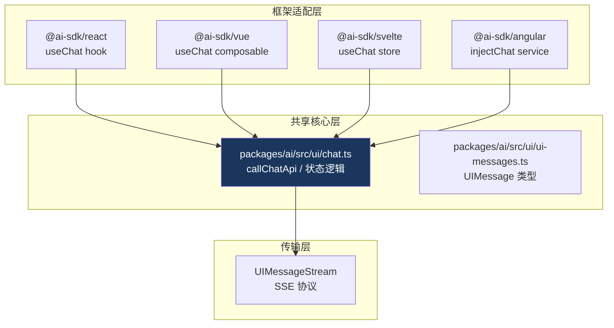

# 19. 多框架支持

> 源码位置: `packages/react/`, `packages/vue/`, `packages/svelte/`, `packages/angular/`

## 概述

Vercel AI SDK 支持 React、Vue、Svelte、Angular 四大前端框架。核心逻辑在 `packages/ai/src/ui/` 中共享，各框架包只是薄封装层，将框架无关的状态管理适配为框架特定的 API（hooks、composables、stores、services）。

## 底层原理

### 架构分层



### 各框架 API 对比

| API | React | Vue | Svelte | Angular |
|-----|-------|-----|--------|---------|
| 导入 | `useChat` | `useChat` | `useChat` | `injectChat` |
| 消息 | `messages` (state) | `messages` (ref) | `$messages` (store) | `messages$` (Observable) |
| 输入 | `input` (state) | `input` (ref) | `$input` (store) | `input$` (Observable) |
| 提交 | `handleSubmit` | `handleSubmit` | `handleSubmit` | `handleSubmit` |
| 加载 | `isLoading` | `isLoading` | `$isLoading` | `isLoading$` |
| 包名 | `@ai-sdk/react` | `@ai-sdk/vue` | `@ai-sdk/svelte` | `@ai-sdk/angular` |

### React 实现

```typescript
// packages/react/src/use-chat.ts — 简化版

import { useState, useCallback, useRef } from 'react';
import { callChatApi } from 'ai/ui'; // 共享核心

export function useChat({ api = '/api/chat', ...options } = {}) {
  const [messages, setMessages] = useState(options.initialMessages ?? []);
  const [input, setInput] = useState('');
  const [isLoading, setIsLoading] = useState(false);
  const abortControllerRef = useRef<AbortController | null>(null);

  const handleSubmit = useCallback(async (e) => {
    e?.preventDefault();
    if (!input.trim()) return;
    
    const userMessage = { id: generateId(), role: 'user', content: input };
    setMessages(prev => [...prev, userMessage]);
    setInput('');
    setIsLoading(true);
    
    abortControllerRef.current = new AbortController();
    
    await callChatApi({
      api,
      messages: [...messages, userMessage],
      abortController: abortControllerRef.current,
      onUpdate: (updatedMessages) => setMessages(updatedMessages),
      onFinish: () => setIsLoading(false),
    });
  }, [input, messages, api]);

  const stop = useCallback(() => {
    abortControllerRef.current?.abort();
  }, []);

  return { messages, input, setInput, handleSubmit, isLoading, stop, ... };
}
```

### Vue 实现

```typescript
// packages/vue/src/use-chat.ts — 简化版

import { ref, computed } from 'vue';
import { callChatApi } from 'ai/ui';

export function useChat({ api = '/api/chat', ...options } = {}) {
  const messages = ref(options.initialMessages ?? []);
  const input = ref('');
  const isLoading = ref(false);

  async function handleSubmit() {
    if (!input.value.trim()) return;
    
    const userMessage = { id: generateId(), role: 'user', content: input.value };
    messages.value = [...messages.value, userMessage];
    input.value = '';
    isLoading.value = true;
    
    await callChatApi({
      api,
      messages: messages.value,
      onUpdate: (updated) => { messages.value = updated; },
      onFinish: () => { isLoading.value = false; },
    });
  }

  return { messages, input, handleSubmit, isLoading, ... };
}
```

### Svelte 实现

```typescript
// packages/svelte/src/use-chat.ts — 简化版

import { writable, derived } from 'svelte/store';
import { callChatApi } from 'ai/ui';

export function useChat({ api = '/api/chat', ...options } = {}) {
  const messages = writable(options.initialMessages ?? []);
  const input = writable('');
  const isLoading = writable(false);

  async function handleSubmit() {
    // 类似逻辑，使用 Svelte store API
    messages.update(prev => [...prev, userMessage]);
    input.set('');
    isLoading.set(true);
    
    await callChatApi({ ... });
  }

  return { messages, input, handleSubmit, isLoading, ... };
}
```

### 共享核心的关键

```typescript
// packages/ai/src/ui/chat.ts — 框架无关的核心逻辑

// 这个文件包含：
// 1. callChatApi — HTTP 请求和 SSE 解析
// 2. 消息状态更新逻辑
// 3. UIMessage 处理（合并 chunks 到消息）
// 4. 工具调用处理
// 5. 错误处理

// 各框架包只需要：
// 1. 将框架的状态原语（useState/ref/writable）连接到核心逻辑
// 2. 暴露框架惯用的 API 形式
```

### 与 Claude Code / Codex 的对比

| 维度 | Vercel AI SDK | Claude Code | Codex |
|------|--------------|-------------|-------|
| 框架数量 | 4（React/Vue/Svelte/Angular） | 1（Ink/React） | 1（Ratatui） |
| 共享核心 | packages/ai/src/ui/ | 无 | 无 |
| 适配层厚度 | 薄（~100 行） | 不适用 | 不适用 |
| 运行环境 | 浏览器 | 终端 | 终端 |
| 状态管理 | 各框架原生 | React state | Rust state |

## 设计原因

- **共享核心**：HTTP 请求、SSE 解析、消息处理等逻辑只写一次
- **薄适配层**：各框架包只做状态原语的桥接，减少维护成本
- **框架惯用**：React 用 hooks，Vue 用 composables，Svelte 用 stores，Angular 用 services
- **独立发布**：各框架包独立版本，不强制用户安装不需要的框架

## 关联知识点

- [useChat](/ui/use-chat) — React 版本详解
- [UIMessageStream](/streaming/ui-message-stream) — 传输协议
- [Monorepo 架构](/build/monorepo) — 多包管理
